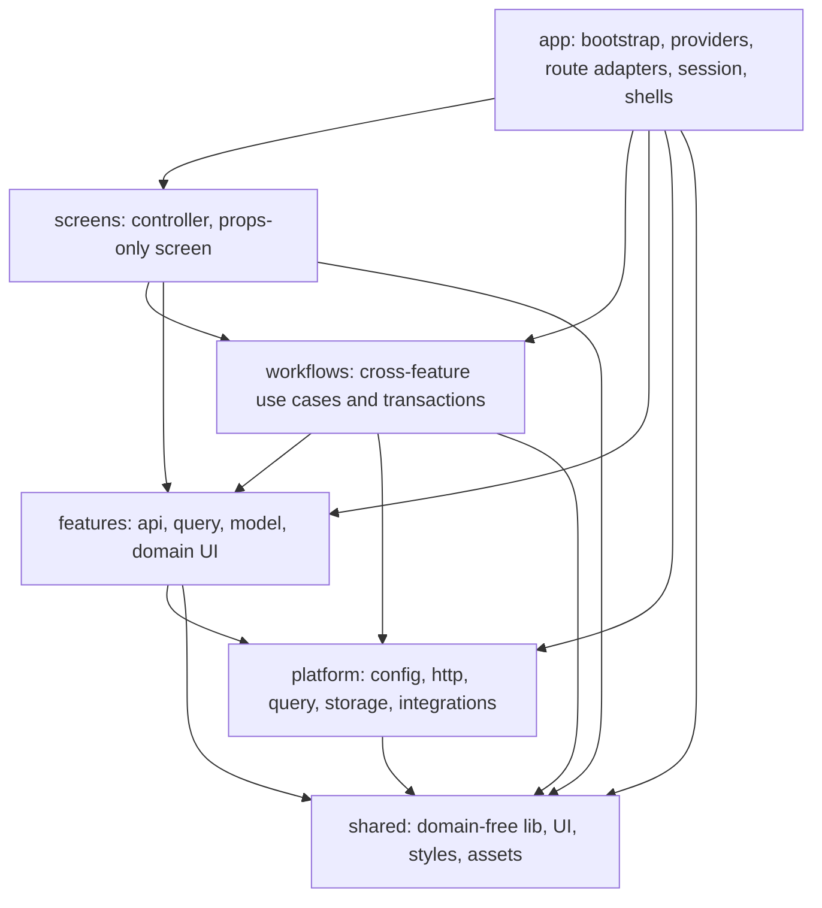
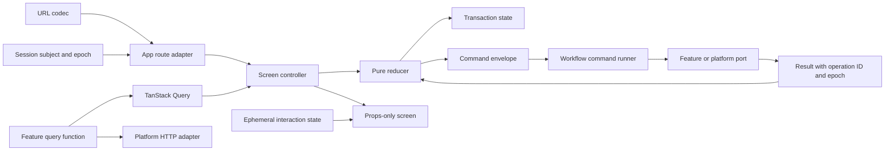
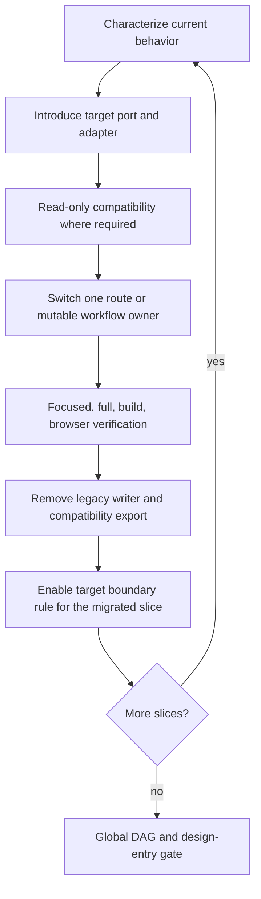
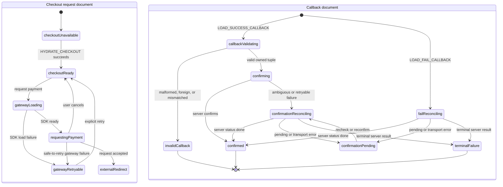
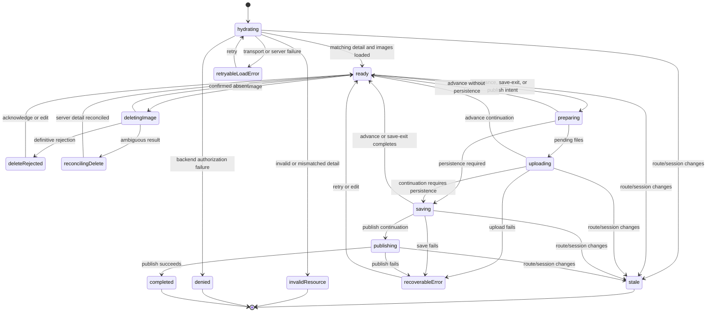
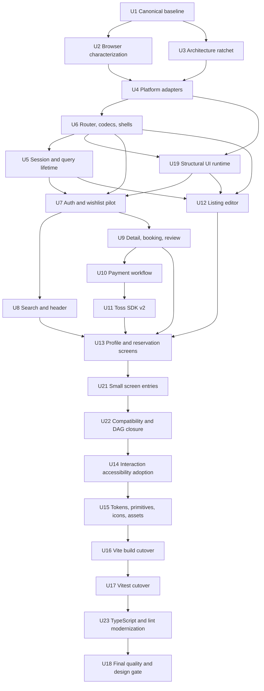

# refactor: Rebuild Airbob frontend architecture

## Summary

Airbob 프론트엔드를 현재 사용자 동작과 backend/API 계약을 보존하면서 단방향 의존 구조로 재구축한다. 목표 범위는 app bootstrap, routing, session/query/storage, API와 외부 SDK adapter, cross-feature workflow, route screen, UI foundation, 테스트·CI, Vite/Vitest 전환과 문서 체계까지이며 실제 Airbnb 시각 디자인은 후속 작업으로 남긴다.

---

## Problem Frame

현재 코드는 기능을 구현하는 데는 성공했지만 URL, Query, session, browser storage, transaction, route JSX가 여러 owner에 걸쳐 있다. `features/*/appShell.ts`와 `publicCache.ts`는 private import를 줄였지만 feature-level cycle과 initial chunk 누수를 허용한다. payment, editor, search는 이미 상태 머신처럼 동작하지만 refs, booleans, effects, route callbacks에 전이가 분산돼 있다.

7월 이후 구조 변경은 `pages` 제거, feature route 직접 lazy load, Query/API boundary, race/session hardening이라는 한 방향으로 수렴했다. 반면 동일한 “pre-design”, “design-ready”, “architecture freeze” 계획이 반복됐고, sibling commit `2d1c2d9`에는 이번 범위와 거의 같은 21-task 계획이 이미 존재한다. 새 계획은 해결된 작업을 반복하지 않고 current HEAD의 unresolved delta만 실행한다.

최대 범위 변경은 허용하지만 big-bang rewrite는 허용하지 않는다. 기존 흐름을 characterization한 뒤 route 또는 mutable workflow 하나씩 새 owner로 전환하고, 같은 단위에서 legacy writer와 compatibility surface를 제거한다.

---

## Scope Boundaries

### In Scope

- 모든 frontend runtime module과 디렉터리 경계를 목표 DAG에 맞게 이동하거나 재작성한다.
- route metadata, query codec, shell, route adapter, controller, screen 책임을 분리한다.
- auth/session identity, Query cache lifetime, browser storage ownership을 하나의 application boundary로 통합한다.
- payment, reservation handoff, review submission, listing editor, search orchestration을 typed reducer/statechart와 workflow로 재구성한다.
- Axios/envelope/external SDK를 platform adapter 뒤로 이동하고 critical external input을 runtime 검증한다.
- cross-feature invalidation과 handoff를 workflow로 이동하고 direct feature-to-feature import를 제거한다.
- shared UI, overlay, layout, responsive, accessibility, token, icon, asset foundation을 재정의한다.
- source-string/manual-list architecture tests를 graph, lint, behavior test로 교체한다.
- deterministic Playwright, live smoke, bundle/asset budget을 분리해 운영한다.
- CRA/Jest를 Vite/Vitest로 단계적으로 교체하고 Node·TypeScript·lint 구성을 현대화한다.
- architecture, QA, project overview, glossary와 historical-plan index를 current HEAD에 맞춘다.

### Non-Goals

- backend endpoint, request/response field, cookie/session protocol, DB, server authorization을 변경하지 않는다.
- URL path와 query key를 제품 개선 목적으로 변경하지 않는다.
- 결제 상품, merchant key 유형, 결제 UX를 바꾸지 않는다.
- 새로운 Redux, Zustand 또는 전역 상태 저장소를 도입하지 않는다.
- visual Airbnb redesign, 새 검색 기능, 새 예약 정책, 새 리뷰 정책을 만들지 않는다.
- 모든 API response에 schema library를 일괄 적용하지 않는다.

### Deferred to Follow-Up Work

- Airbnb visual redesign은 이 계획의 design-entry gate 통과 뒤 screen vertical slice로 진행한다.
- XState는 TypeScript/Vite 전환 뒤 typed reducer가 계층·병렬 state를 감당하지 못할 때 domain-local pilot으로만 재평가한다.
- native `<dialog>` 전환은 portal 기반 Dialog의 접근성 계약을 먼저 안정화한 뒤 비교한다.
- canonical URL rewrite, deep-link back-navigation 개선, 새로운 loading/error copy는 parity migration 뒤 제품 변경으로 다룬다.
- Storybook 또는 별도 component catalog 도입은 production primitive가 정리된 뒤 결정한다.

---

## Requirements

### Behavior and Contract Preservation

- R1. 현재 15개 route의 path, query, hash, direct-load, refresh, back/forward 결과를 보존한다.
- R2. backend API version, endpoint, payload, envelope, cookie credential과 server-authoritative validation을 변경하지 않는다.
- R3. 인증 복귀, 검색 복원, wishlist propagation, 예약 handoff, 결제 복구, review partial success, editor operation ordering을 보존한다.
- R4. 권한 거절, network failure, retryable failure, terminal failure를 anonymous 또는 generic redirect로 합치지 않는다.
- R5. route-level lazy chunk를 유지하고 initial bundle이 broad public barrel 때문에 커지지 않게 한다.

### Architecture and Ownership

- R6. production dependency는 `app → route adapters/screens/workflows/features/platform/shared`, `screens → workflows/features/shared`, `workflows → feature public ports/platform/shared`, `features → platform/shared`, `platform → shared` 방향의 DAG를 만족한다.
- R7. `features`는 자체 API/query/model/UI를 소유하며 다른 feature를 직접 import하지 않는다.
- R8. app-owned route adapter가 Router/session/codec을 읽고 typed input과 navigation command를 controller에 전달하며, `screens`는 controller와 props-only Screen만 소유한다.
- R9. cross-feature mutation, cache reconciliation, pending auth action, navigation handoff는 `workflows`가 소유한다.
- R10. 한 mutable workflow에는 어느 시점에도 active writer가 하나만 존재하며 cutover 단위가 끝나면 legacy writer를 삭제한다.
- R11. `appShell.ts`, `publicCache.ts`, route-only feature barrel은 consumer migration 뒤 제거한다.

### State, Session, and Data

- R12. shareable state는 URL codec, server state는 TanStack Query, identity lifetime은 app session, transaction은 typed reducer, ephemeral interaction은 local state가 소유한다.
- R13. session은 bootstrap `checking`, `authenticated`와 revalidation substate, `anonymous`와 server-revocation status, retryable `error`를 구분하고 identity epoch를 제공한다.
- R14. A 사용자 작업이 logout 뒤 B 사용자 session의 Query, storage 또는 screen에 나타나지 않는다.
- R15. 사용자 종속 Query option은 viewer/session scope를 명시하고 수동 query-root registry에 의존하지 않는다.
- R16. browser storage record는 purpose, 허용 필드, PII 등급, schema version, opaque subject owner, created/expiry, validation과 cleanup policy를 가지며 reload에 필요하지 않은 값을 저장하지 않는다.
- R17. route codec은 parse, normalize, serialize, canonical comparison을 한 owner에서 제공하고 round-trip을 보장한다.
- R18. Query 또는 URL에서 파생할 수 있는 값을 React state로 복제하지 않는다.

### Platform and Transactions

- R19. transport, envelope, cancellation, authentication, validation, conflict, server failure를 하나의 typed frontend error model로 정규화한다.
- R20. feature API adapter가 wire request/response type과 mapper를 소유하고 critical callback/storage payload를 runtime 검증한다.
- R21. Google Maps, Places, Toss, Daum, environment, image URL과 browser storage 접근은 platform adapter를 통해서만 수행한다.
- R22. payment와 editor는 exhaustive state/event/transition contract, stale-result fence, workflow instance/operation ID당 at-most-one active command 조건을 가진다.
- R23. active checkout path는 하나만 유지하고 retryable payment failure에서만 checkout/callback을 보존한다.
- R24. Toss workflow와 Toss SDK v2 adapter 교체를 서로 다른 cutover로 수행한다.

### UI Foundation

- R25. browse, form, transaction, editor, bare shell이 landmark와 content-width 책임을 명확히 나눈다.
- R26. Dialog와 Toast는 app-level portal owner를 공유한다. Dialog는 focus, Escape, backdrop, scroll lock, stack, restore contract를 만족하고 Toast는 live-message와 route-unmount cleanup contract를 만족한다.
- R27. CSS와 JS는 같은 responsive policy를 사용하며 320, 375, 768, 1023, 1024, 1025, 1440 viewport를 보호한다.
- R28. token은 primitive, semantic, component 계층을 가지며 vendor exception 밖의 새 raw color, shadow, radius, breakpoint, `!important`를 차단한다.
- R29. production 사용 사례가 없는 shared primitive는 삭제하고 실제 control inventory에서 파생된 primitive만 유지한다.
- R30. icon, brand asset, remote image, responsive image, alt/aspect-ratio 정책을 한 foundation으로 통합한다.

### Verification and Toolchain

- R31. 각 migration slice는 characterization-first이며 focused test, full static gate, build, independent review를 통과한다.
- R32. deterministic Playwright는 mocked backend/Maps/Toss/clock으로 PR을 보호하고 live smoke는 별도 integration gate로 유지한다.
- R33. dependency graph, unused production surface, dependency classification, CSS policy는 자동 discovery 도구로 검증한다.
- R34. Vite 전환은 env, proxy, output, CSS Modules, public assets, lazy chunks, direct refresh parity를 증명한다.
- R35. Jest와 Vitest는 전환 중 서로 겹치지 않는 suite ownership으로 공존하며, 각 suite는 Jest baseline을 기록한 뒤 Vitest로 원자 전환해 behavior parity를 증명한다.
- R36. 로컬과 CI가 동일한 canonical gate에서 typecheck, lint, architecture, unit/integration, build, deterministic browser를 수행한다.
- R37. 이전 freeze와 plan의 역사적 근거는 보존하되 current architecture source of truth는 하나만 둔다.

---

## Key Technical Decisions

- KTD1. **Maximum target, incremental delivery:** 최종 디렉터리와 ownership은 크게 바꾸되 route/workflow strangler migration으로 전환한다. 장기간 dual implementation은 허용하지 않는다.
- KTD2. **Introduce a real screen layer, not page adapters:** `app/router/routes`는 route adapter를 소유하고 `screens`는 controller, props-based Screen, presentation model을 소유한다. 삭제된 `pages`처럼 한 줄 re-export만 하는 계층은 만들지 않는다.
- KTD3. **Enforce a dependency DAG:** `app`은 route/session/shell 조립, `screens`는 presentation orchestration, `workflows`는 cross-feature use case, `features`는 domain capability, `platform`은 external I/O, `shared`는 domain-free code를 소유한다. Workflow peer import는 금지하고 app route adapter가 capability를 조립한다. App은 narrow feature UI/port만 composition할 수 있다.
- KTD4. **No general-purpose global store:** URL, Query, session, reducer, local state의 owner를 분리한다. store library 추가로 ownership 문제를 숨기지 않는다.
- KTD5. **Typed reducer/statechart before XState:** 현재 transaction은 route-local이며 spawned actor, parallel region, delayed orchestration 또는 persisted machine runtime이 필요하지 않으므로 discriminated state/event와 pure reducer를 사용한다. Orthogonal concern은 작은 reducer로 나누고 side effect는 command runner 밖에서 실행한다. 실제 state explosion이 증명될 때 payment 또는 editor 한정 pilot로만 XState를 재평가한다.
- KTD6. **Session subject and epoch guard async work:** stable authenticated subject는 storage owner와 viewer Query scope에 사용하고 epoch는 async fence에 사용한다. Viewer-dependent query option은 subject/epoch를 key와 meta에 포함하고 AbortSignal을 transport까지 전달한다. Mutation/workflow callback은 captured epoch가 다르면 cache, navigation, storage를 변경하지 않는다.
- KTD7. **Correctness over public-cache retention during migration:** viewer-specific DTO가 남아 있는 기간에는 identity transition에서 전체 relevant cache를 clear한다. membership overlay 전환 뒤에만 public cache retention을 허용한다.
- KTD8. **Platform owns external contracts:** env, Axios, API envelope, browser storage, Maps, Toss, Daum은 platform adapter만 직접 접근한다. feature는 typed port를 소비한다.
- KTD9. **Current Toss v1 becomes a temporary adapter:** payment aggregate를 현 v1 behavior 위에서 먼저 안정화하고 별도 deployable cutover에서 공식 npm SDK v2 adapter로 교체한다. Browser callback와 marker는 untrusted hint이며 server confirm/status가 confirmed와 server payment outcome의 유일한 authority다. Local validation은 결제 성공을 주장하지 않는 invalid terminal을 만들 수 있다.
- KTD10. **React Router mode stays declarative:** 이번 계획은 route ownership을 정리하지만 data-router migration을 도입하지 않는다. URL과 route behavior를 바꾸지 않는 것이 우선이다.
- KTD11. **Static rules have one owner each:** dependency-cruiser는 graph, Knip은 reachability/dependency, Stylelint는 CSS, ESLint는 local import/code feedback을 소유한다. 동일 규칙을 source-string Jest test로 중복하지 않는다.
- KTD12. **Browser verification has two tiers:** deterministic Playwright는 PR blocking이고 live backend/Toss sandbox smoke는 nightly 또는 pre-release integration evidence다.
- KTD13. **UI foundation precedes visual redesign:** overlay, shell, breakpoint, semantics, token, icon, asset만 이 계획에서 정리하고 visual styling은 하지 않는다.
- KTD14. **Vite and Vitest are separate cutovers:** Vite가 build/dev를 먼저 소유하고 existing Jest gate를 유지한다. 이후 Jest-remaining과 Vitest-owned suite를 disjoint하게 운영하며 suite별 baseline 비교와 원자 전환을 거쳐 CRA/Jest를 제거한다.
- KTD15. **Build output remains compatible:** 저장소 밖 배포 소비자를 확인할 때까지 production output은 `build/`를 유지하고 SPA fallback과 previous asset retention 요구를 문서화한다.
- KTD16. **Historical plans are indexed, not copied:** current plan과 architecture docs가 유일한 실행 기준이며 과거 plan은 supersession index로만 연결한다.

---

## High-Level Technical Design

### Target Dependency Topology



`feature → feature`, `workflow → workflow`, `shared → upper layer`, `platform → feature`, `workflow → screen`, `screen → app`, `screen → screen`은 금지한다. Route config는 `app/router/routes/*Route`를 직접 lazy import하고 각 adapter가 해당 screen chunk를 포함한다. App의 feature import는 Header 등 composition-only narrow UI/port로 제한한다.

### State Ownership



- URL은 direct load와 history에 남아야 하는 값만 소유한다.
- Query는 서버 resource와 mutation 결과만 소유한다.
- Session은 identity, auth terminal, epoch, logout cleanup을 소유한다.
- Reducer는 payment/editor의 장기 transition을 소유한다. Search reducer는 draft/popover/bottom-sheet 같은 interaction state만 소유하고 committed URL 또는 Query result를 복제하지 않는다.
- Component local state는 popover, focus, hover처럼 재생할 필요 없는 값만 소유한다.
- Adapter는 reducer나 QueryClient를 직접 변경하지 않는다. Cross-cache effect는 workflow가 feature-owned reconciliation port를 호출한다.

### Slice Cutover Lifecycle



Mutable operation에는 shadow write를 사용하지 않는다. Read compatibility가 필요한 storage 또는 route codec만 짧은 dual-read 기간을 허용한다.

### Payment Transaction



`booking-payment` aggregate 하나가 checkout/callback repository와 두 document transition을 소유한다. Checkout record는 handoff부터 ready/request/redirect/ambiguous confirmation 동안 유지한다. Callback record는 validation 이후 ambiguous confirmation 동안만 유지한다. Confirmation branch는 결제가 이미 인증됐을 수 있으므로 payment request branch로 돌아가지 않는다. Browser marker hit도 reconciliation으로 보내며 confirmed, invalid, terminal, logout, expiry에서만 정리한다. Server confirm과 status가 confirmed와 server payment outcome의 유일한 authority이고, local validation은 성공을 주장하지 않는 invalid terminal만 만들 수 있다.

### Accommodation Editor Transaction



Immediate server image deletion은 현 behavior대로 유지한다. Operation context는 `advance`, `save-exit`, `publish` intent와 successful subcommand journal, committed baseline을 보존해 retry가 upload/PATCH를 중복 실행하지 않게 한다. Working draft, Query server baseline, persistence operation state는 서로 다른 authority다. Reconciliation이 끝나기 전 next, save, publish를 차단하며 이전 operation/session completion은 상태를 변경하지 못한다.

---

## Output Structure

```text
src/
  app/
    bootstrap/
    providers/
    router/
      codecs/
      routes/
    session/
    shells/
    overlays/
    notifications/

  screens/
    home/
    search/
    accommodation-detail/
    accommodation-edit/
    reservation-confirm/
    reservation-detail/
    payment-result/
    review-create/
    wishlist/
    profile/
    auth/
    not-found/

  workflows/
    auth-intent/
    wishlist-membership/
    booking-payment/
      reservation-create/
      checkout/
      confirmation/
    review-submission/
    listing-editor/
    host-listing-management/

  features/
    auth/
      api/
      model/
      query/
      ui/
    accommodations/
      api/
      model/
      query/
      ui/
    reservations/
      api/
      model/
      query/
      ui/
    reviews/
      api/
      model/
      query/
      ui/
    search/
      api/
      model/
      query/
      ui/
    wishlist/
      api/
      model/
      query/
      ui/
    profile/
      api/
      model/
      query/
      ui/

  platform/
    config/
    http/
    query/
    session/
    storage/
    integrations/

  shared/
    lib/
    ui/
    styles/
    assets/

  test/
    fixtures/
    renderApp.tsx
    createTestQueryClient.ts

tests/
  architecture/
  e2e/
    fixtures/
    specs/
```

기존 `src/routes`, `src/layouts`, `src/contexts`, `src/query`, `src/api`, `src/hooks`, `src/components`, `src/styles`는 consumer migration 동안 compatibility source가 될 수 있지만 최종 구조에는 남기지 않는다.

---

## Phased Delivery



U2와 U3는 병렬 준비가 가능하다. Safe return-target codec과 route contract가 session보다 먼저 필요하므로 U6 뒤 U5를 수행한다. U7 이후 route/workflow cutover는 동일 mutable owner를 건드리지 않는 경우에만 병렬화한다.

---

## Implementation Units

### U1. Establish the Canonical Baseline and Cutover Registry

- **Goal:** current HEAD의 behavior, owner, unresolved delta와 historical-plan 관계를 하나의 기준으로 고정한다.
- **Requirements:** R1-R5, R10, R31, R37
- **Dependencies:** None
- **Files:**
  - Create `docs/architecture/current-frontend-architecture.md`
  - Create `docs/architecture/frontend-migration-rules.md`
  - Create `docs/architecture/frontend-ownership-matrix.md`
  - Create `docs/architecture/frontend-browser-data-inventory.md`
  - Create `docs/archive/frontend-refactor-plan-index.md`
  - Modify `CONCEPTS.md`
  - Modify `PROJECT_OVERVIEW.md`
  - Modify `README.md`
  - Modify `docs/qa/frontend-architecture-smoke.ko.md`
  - Modify or supersede `docs/architecture/frontend-architecture-freeze.ko.md`
  - Modify or supersede `docs/architecture/frontend-structure-refactor.md`
- **Approach:** route, URL, query, mutation, storage, shell, screen owner를 표로 기록한다. 각 slice에 old owner, new owner, read compatibility, active writer, rollback reader, removal condition을 둔다. Browser data inventory는 record purpose, field별 reload necessity와 PII 등급, subject owner, TTL, log/trace/screenshot policy를 기록한다. Pre-U10 legacy→U10→U11→U10 rollback compatibility matrix도 ownership 문서에 포함한다. 과거 plan은 git history와 current delta를 연결하는 index로만 보존한다.
- **Patterns to follow:** `CONCEPTS.md`의 glossary 형식과 `docs/solutions/workflow-issues/frontend-architecture-verification-loop.md`의 verification loop.
- **Test scenarios:** Test expectation: none — documentation and ownership baseline only.
- **Verification:** current route graph, current scripts, current production consumers와 문서가 모순되지 않고 후속 unit이 참조할 owner/cutover 조건이 모두 존재한다.

### U2. Add Deterministic Browser Characterization

- **Goal:** architecture migration 전에 핵심 사용자 흐름을 mocked Playwright로 고정한다.
- **Requirements:** R1-R4, R20, R31, R32, R36
- **Dependencies:** U1
- **Files:**
  - Modify `package.json`
  - Create `playwright.config.ts`
  - Create `tests/e2e/fixtures/api.ts`
  - Create `tests/e2e/fixtures/session.ts`
  - Create `tests/e2e/fixtures/paymentGateway.ts`
  - Create `tests/e2e/specs/auth-session-characterization.spec.ts`
  - Create `tests/e2e/specs/search-wishlist-characterization.spec.ts`
  - Create `tests/e2e/specs/reservation-payment-characterization.spec.ts`
  - Create `tests/e2e/specs/profile-review-characterization.spec.ts`
  - Create `tests/e2e/specs/accommodation-editor-characterization.spec.ts`
  - Create `docs/qa/frontend-target-contract-matrix.md`
  - Modify `.github/workflows/frontend.yml`
  - Modify `.gitignore`
  - Keep `scripts/smoke/frontend-smoke.mjs` as live integration smoke
- **Approach:** `page.route()`로 backend와 external script를 고정하고 test별 BrowserContext, fixed clock, explicit storage/session을 사용한다. App asset origin 밖의 network는 default-deny하며 unhandled request와 service worker는 즉시 실패한다. Deterministic suite는 synthetic `.invalid` identity만 사용하고 reusable real auth state를 만들지 않는다. Trace/video/screenshot은 synthetic fixture에서만 실패 시 짧게 보존하며 callback URL, storage, PII를 redact한다. Mutation fixture는 request count와 ordering을 기록한다. Live smoke credentials와 artifacts는 제한된 integration job만 소유한다.
- **Execution note:** 기존 behavior를 바꾸지 않는 characterization test부터 추가한다. 불안정한 current behavior가 발견되면 별도 bug decision 없이 test 기대값을 개선하지 않는다.
- **Patterns to follow:** current fake clock tests, route/query tests, payment/editor race regression tests.
- **Test scenarios:**
  - Covers AE1. Current protected deep link, login return, modal-close cancellation behavior를 고정한다.
  - Covers AE3. Current Search direct load, refresh, pagination, map drag, back/forward request를 고정한다.
  - Covers AE4. Current wishlist mutation이 search/detail/recent/list에 투영되는 결과를 고정한다.
  - Covers AE5. Current reservation validation, create, handoff와 unmount fence를 고정한다.
  - Covers AE6-AE7. Current checkout reload, callback validation, confirm dedupe, status reconciliation terminal을 고정한다.
  - Covers AE8. Current review create와 image partial-failure terminal을 고정한다.
  - Covers AE9. Current editor hydration, delete reconciliation, upload/save/publish ordering과 stale fence를 고정한다.
  - 모든 unhandled external network request, real credential 사용, artifact PII 노출이 실패한다.
  - 현재 코드가 충족하지 못하는 cross-session, 1024px, portal/a11y 목표는 target matrix에 owner U-ID와 activation condition을 가지며 skip을 verified로 집계하지 않는다.
- **Verification:** current intended behavior가 deterministic하게 green이고, 알려진 target gap에는 owner/activation unit이 있으며, backend/Maps/Toss 실네트워크와 credential/PII artifact가 0이다.

### U3. Introduce Architecture, Reachability, and Style Ratchets

- **Goal:** target DAG와 dead/style debt를 자동 발견하되 baseline debt를 suppression wall 없이 점진적으로 닫는다.
- **Requirements:** R6-R11, R28, R29, R31, R33, R36
- **Dependencies:** U1
- **Files:**
  - Modify `package.json`
  - Create `.dependency-cruiser.cjs`
  - Create `knip.json`
  - Create `.stylelintrc.cjs`
  - Create `tests/architecture/dependency-rules.md`
  - Modify `.github/workflows/frontend.yml`
  - Modify `src/routes/route-boundary-contracts.test.ts`
  - Modify `src/api/ui-api-boundary-contracts.test.ts`
  - Modify `src/shared/ui/shared-ui-boundary-contracts.test.ts`
  - Modify `src/styles/tokens.test.ts`
  - Modify `src/verification-gate.test.ts`
- **Approach:** dependency-cruiser가 layer direction, cycle, unresolvable, devDependency import를 소유한다. Knip은 lazy route, test, script entry를 모두 등록하고 report-only → changed-surface ratchet → global strict 순서로 전환한다. Stylelint는 token reference와 vendor override를 구분한다. 새 도구가 동일 위반을 잡는 fixture evidence가 생긴 뒤 기존 source-string test를 제거한다.
- **Execution note:** tool을 global error로 켜기 전에 current violations와 삭제 milestone을 기록한다.
- **Patterns to follow:** existing strict lint gate와 current route/API/UI boundary intent.
- **Test scenarios:**
  - Forbidden feature-to-feature import fixture가 dependency rule에 실패한다.
  - Folder cycle과 type-only cycle fixture가 탐지된다.
  - Lazy app route-adapter entry와 그 screen module이 Knip에서 unused file로 오인되지 않는다.
  - Production file의 test-only dependency import가 실패한다.
  - Token file 밖 raw color, unknown custom property, unknown custom media, unapproved `!important`가 실패한다.
  - Vendor integration override는 좁은 documented exception에서만 통과한다.
- **Verification:** 각 rule의 single owner가 문서화되고 migrated slice는 exception 0이며 기존 duplicate source-contract checks가 제거된다.

### U4. Build Platform Adapters and Shared Test Harnesses

- **Goal:** framework, environment, HTTP, storage와 external global을 feature code에서 분리한다.
- **Requirements:** R19-R21, R31, R34-R36
- **Dependencies:** U2, U3
- **Files:**
  - Create `src/platform/config/env.ts`
  - Create `src/platform/config/env.test.ts`
  - Create `src/platform/config/publicRuntimeConfig.ts`
  - Create `src/platform/config/publicRuntimeConfig.test.ts`
  - Create `src/platform/http/client.ts`
  - Create `src/platform/http/client.test.ts`
  - Create `src/platform/http/envelope.ts`
  - Create `src/platform/http/envelope.test.ts`
  - Create `src/platform/http/errors.ts`
  - Create `src/platform/http/errors.test.ts`
  - Create `src/platform/query/createQueryClient.ts`
  - Create `src/platform/storage/versionedSessionStorage.ts`
  - Create `src/platform/storage/versionedSessionStorage.test.ts`
  - Create `src/platform/integrations/googleMaps.ts`
  - Create `src/platform/integrations/tossPaymentsV1.ts`
  - Create `src/platform/integrations/daumPostcode.ts`
  - Create `src/test/renderApp.tsx`
  - Create `src/test/createTestQueryClient.ts`
  - Modify `src/api/client.ts`
  - Modify `src/api/request.ts`
  - Modify `src/api/response.ts`
  - Modify `src/setupTests.ts`
- **Approach:** env adapter는 CRA names를 계속 지원하고 consumer는 `process.env`를 직접 읽지 않는다. Browser-public allowlist는 API URL, Maps browser key, Toss client key, CloudFront domain만 허용하며 unknown env와 secret-key category를 bundle에 전달하지 않는다. Axios instance는 하나만 platform으로 추출하고 legacy API facade는 기존 error surface를 유지한다. `AppError` 변환은 migrated feature adapter 경계에서만 적용해 전역 semantic cutover를 피한다. Versioned storage는 purpose별 field allowlist, PII class, stable subject owner, expiry, one-way migration/cleanup을 제공한다. Legacy record는 authenticated server data로 owner/order를 검증할 수 있을 때만 승격하고 그 외에는 purge한다. Current Toss v1 runtime은 temporary gateway adapter 뒤에 둔다.
- **Patterns to follow:** `src/api/response.ts`의 envelope validation, pure parser/helper tests, Query hook test harness.
- **Test scenarios:**
  - Development proxy와 production API domain이 current URL을 만든다.
  - Missing/invalid env는 secret을 노출하지 않는 typed config error가 된다.
  - Public config allowlist 밖 QA password, Toss secret, cookie/token canary가 serialized config와 built-source fixture에 나타나지 않는다.
  - Axios no-response, timeout, cancel, 401, validation, conflict, 5xx가 서로 다른 `AppError`가 된다.
  - Invalid/missing envelope data와 nullable command response가 current contract를 유지한다.
  - Version mismatch, expired record, foreign owner, malformed JSON, unknown extra field는 storage read에 실패하고 안전하게 정리된다.
  - Legacy record는 current authenticated owner와 server reservation tuple을 검증한 경우에만 one-way migrate되고 원본이 삭제된다.
  - Google/Daum/Toss loader가 중복 호출되지 않고 failure를 typed error로 반환한다.
  - Shared render harness가 Router, Query, session, portal root를 동일하게 구성한다.
- **Verification:** feature/screen이 Axios, `process.env`, storage, external global script를 새로 직접 사용할 수 없고 legacy consumers의 current error behavior와 migrated consumers의 `AppError` behavior가 각각 통과한다.

### U5. Replace Auth Boolean State with an Explicit Session Boundary

- **Goal:** auth bootstrap, identity transition, cache/storage cleanup과 stale async protection을 하나의 app owner로 통합한다.
- **Requirements:** R3-R4, R12-R16, R19, R31
- **Dependencies:** U4, U6
- **Files:**
  - Create `src/app/session/sessionState.ts`
  - Create `src/app/session/sessionReducer.ts`
  - Create `src/app/session/sessionReducer.test.ts`
  - Create `src/app/session/SessionProvider.tsx`
  - Create `src/app/session/SessionProvider.test.tsx`
  - Create `src/app/session/useSession.ts`
  - Create `src/platform/session/sessionBroadcast.ts`
  - Create `src/platform/session/sessionBroadcast.test.ts`
  - Modify `src/app/providers/AppProviders.tsx` or create it
  - Modify `src/contexts/AuthContext.tsx`
  - Modify `src/contexts/AuthContext.test.tsx`
  - Modify `src/features/auth/hooks/useSessionQuery.ts`
  - Modify `src/features/auth/lib/sessionLifecycle.ts`
  - Modify `src/features/auth/lib/sessionLifecycle.test.ts`
  - Modify `src/query/QueryProvider.tsx`
  - Modify `src/query/sessionCacheBoundary.ts`
  - Modify `src/query/sessionCacheBoundary.test.ts`
  - Modify `src/routes/RequireAuth.tsx`
  - Modify `src/routes/RequireAuth.test.tsx`
  - Modify `src/utils/authEvents.ts`
- **Approach:** session state는 bootstrap checking, authenticated active/revalidating/revalidation-error, anonymous revocation-verified/unverified, retryable bootstrap error를 구분한다. Login/logout/401은 epoch를 변경하고 session-owned Query와 storage를 clear한다. Viewer-dependent query option은 stable subject/epoch key와 meta를 사용하고 Query AbortSignal을 HTTP까지 전달한다. 각 mutation/workflow command는 시작 epoch를 캡처한다. Logout API 실패는 local anonymous를 되돌리지 않지만 server revocation을 verified로 표시하지 않으며 보안 알림과 재검증 경로를 제공한다. BroadcastChannel 기반 same-origin tab event는 다른 tab의 epoch를 올리고 `/me` 재검증을 유도한다. `document.cookie` 삭제를 logout 성공 evidence로 사용하지 않는다. `AuthContext`는 consumer migration 동안 adapter로 남았다가 제거한다.
- **Execution note:** A→logout→B와 transient `/me` error characterization을 먼저 고정한다.
- **Patterns to follow:** current session lifecycle tests와 payment/editor session fence.
- **Test scenarios:**
  - Initial `/me` pending은 `checking`, 401/M004는 `anonymous`, transport/5xx는 retryable bootstrap `error`다.
  - Authenticated focus revalidation 5xx는 viewer와 cache를 유지한 revalidation error이며 logout으로 바뀌지 않는다.
  - Login 성공은 viewer identity와 새 epoch를 설정하고 old cache를 제거한다.
  - Logout API 500에서도 local state는 anonymous/revocation-unverified이고 Query/storage가 제거되며 refresh와 다른 tab이 server session을 재검증한다.
  - Old epoch query/mutation completion은 B session cache나 UI를 변경하지 않는다.
  - Auth error event가 여러 번 와도 cleanup transition은 idempotent하다.
  - Protected deep link는 checking/error/anonymous/authenticated를 구분해 render 또는 redirect한다.
  - External return target은 거절하고 internal pathname/query/hash만 복원한다.
  - 두 Page가 같은 BrowserContext를 공유할 때 login/logout/401 epoch transition과 background-tab stale mutation이 격리된다.
- **Verification:** `userScopedQueryRoots` 수동 목록이 사라지고 session lifecycle owner가 하나이며 cross-session Playwright scenario가 통과한다.

### U6. Rebuild Router Ownership, Query Codecs, and Shells

- **Goal:** route manifest와 shareable state를 app router가 소유하고 모든 screen에 동일한 route adapter contract를 제공한다.
- **Requirements:** R1, R5-R6, R8, R10, R17-R18, R25, R31
- **Dependencies:** U4
- **Files:**
  - Create `src/app/router/paths.ts`
  - Create `src/app/router/definitions.ts`
  - Create `src/app/router/lazyRoutes.tsx`
  - Create `src/app/router/manifest.ts`
  - Create `src/app/router/Router.tsx`
  - Create `src/app/router/codecs/internalReturnTargetCodec.ts`
  - Create `src/app/router/codecs/internalReturnTargetCodec.test.ts`
  - Create `src/app/router/codecs/searchCodec.ts`
  - Create `src/app/router/codecs/searchCodec.test.ts`
  - Create `src/app/router/codecs/profileCodec.ts`
  - Create `src/app/router/codecs/profileCodec.test.ts`
  - Create `src/app/router/codecs/wishlistCodec.ts`
  - Create `src/app/router/codecs/wishlistCodec.test.ts`
  - Create `src/app/router/codecs/paymentCodec.ts`
  - Create `src/app/router/codecs/paymentCodec.test.ts`
  - Create `src/app/shells/BrowseShell.tsx`
  - Create `src/app/shells/FormShell.tsx`
  - Create `src/app/shells/TransactionShell.tsx`
  - Create `src/app/shells/EditorShell.tsx`
  - Create `src/app/shells/BareShell.tsx`
  - Modify `src/routes/paths.ts`
  - Modify `src/routes/routeDefinitions.ts`
  - Modify `src/routes/routeConfig.tsx`
  - Modify `src/routes/routeQueryContracts.ts`
  - Modify route/query/shell tests under `src/routes/`
- **Approach:** component-free definitions가 id, path, auth, shell, header policy를 소유하고 `lazyRoutes.tsx`가 route ID별 exhaustive route-adapter mapping을 소유한다. Manifest는 Router composition 안에서만 두 record를 결합한다. Route adapter는 params/location/search/session/codec을 읽어 typed input과 navigation commands를 screen controller에 넘긴다. Internal return codec은 same-origin으로 resolve된 structured pathname/search/hash만 허용한다. Query codec은 current invalid-value fallback과 push/replace semantics를 보존하고 derived state를 local state에 mirror하지 않는다. Shell visual은 이 unit에서 current appearance를 유지한다.
- **Execution note:** codec round-trip과 direct URL behavior를 먼저 고정한다.
- **Patterns to follow:** current `paths.ts`, component-free `routeDefinitions.ts`, per-route direct lazy import.
- **Test scenarios:**
  - 모든 route id가 component-free definition과 lazy route-adapter entry 하나를 가진다.
  - Definitions는 React, features, screens를 import하지 않고 shell/header matching은 definitions만 소비한다.
  - Search/Profile/Wishlist/Payment codec은 valid input round-trip과 invalid fallback을 보존한다.
  - Parameter insertion order가 달라도 canonical query가 같다.
  - Search map drag는 replace, destination/page/tab/detail action은 current history semantics를 유지한다.
  - Direct refresh와 protected return target이 pathname/query/hash를 보존한다.
  - Protocol-relative, scheme URL, backslash authority, encoded separator/control character, login/signup loop를 거절하고 valid encoded internal path를 허용한다.
  - Transaction/editor/bare screen은 올바른 shell과 landmark를 선택한다.
  - Route lazy import가 main chunk로 eager-load되지 않는다.
- **Verification:** feature route helper가 query key 이름을 다시 정의하지 않고 app route adapter만 Router/session/codec에 의존하며 15개 lazy route chunk가 유지된다.

### U19. Establish the Structural UI Runtime Before Screen Migration

- **Goal:** 첫 screen slice 전에 portal, overlay stack, shell landmark와 responsive policy의 runtime owner를 고정한다.
- **Requirements:** R25-R27, R31-R32
- **Dependencies:** U4, U6
- **Files:**
  - Create `src/app/overlays/OverlayProvider.tsx`
  - Create `src/app/overlays/OverlayProvider.test.tsx`
  - Create `src/shared/styles/responsive.ts`
  - Create `src/shared/styles/responsive.test.ts`
  - Modify `src/shared/ui/Dialog/Dialog.tsx`
  - Modify `src/shared/ui/Dialog/Dialog.test.tsx`
  - Modify `src/shared/ui/ToastHost/ToastHost.tsx`
  - Modify app shell components and tests
  - Modify `public/index.html`
  - Modify `src/test/renderApp.tsx`
- **Approach:** 기존 Dialog public API는 유지하면서 app-created portal root로 옮긴다. OverlayProvider가 stack, topmost Escape, scroll lock, focus restore를 소유하고 Toast는 같은 portal runtime을 사용한다. Shell 하나만 `<main>`을 소유한다. Shared responsive policy는 CSS custom media source와 JS `matchMedia` query를 같은 값에서 제공한다. `lang="ko"`와 test portal root를 current document에 추가한다.
- **Execution note:** DOM relocation 전에 current focus, Escape, backdrop, body-lock behavior를 characterization한다.
- **Patterns to follow:** existing Dialog/Tabs/TextField accessibility contracts and WAI-ARIA dialog pattern.
- **Test scenarios:**
  - Dialog initial focus, Tab containment, topmost Escape, backdrop, focus return과 nested scroll lock이 current API에서 동작한다.
  - Route unmount 뒤 Toast와 overlay cleanup이 orphan portal node를 남기지 않는다.
  - Shell마다 `<main>`이 정확히 하나이고 hidden header route가 duplicate landmark를 만들지 않는다.
  - JS와 CSS responsive policy가 1023/1024/1025에서 같은 branch를 선택한다.
  - Shared render harness가 production과 같은 portal/shell owner를 사용한다.
- **Verification:** U7 이후 모든 새 screen이 동일 overlay/responsive/shell runtime을 사용하며 legacy local overlay owner가 새로 추가되지 않는다.

### U7. Migrate Auth and Wishlist as the First Vertical Slice

- **Goal:** session-scoped Query와 cross-feature workflow를 낮은 외부 위험에서 검증하고 viewer membership을 search/detail/wishlist 전체에서 일관되게 만든다.
- **Requirements:** R6-R18, R31-R32
- **Dependencies:** U5, U6, U19
- **Files:**
  - Create `src/workflows/auth-intent/authIntent.ts`
  - Create `src/workflows/auth-intent/authIntent.test.ts`
  - Create `src/workflows/wishlist-membership/wishlistMembership.ts`
  - Create `src/workflows/wishlist-membership/wishlistMembership.test.ts`
  - Create `src/workflows/wishlist-membership/legacyProjectionAdapter.ts`
  - Create `src/app/router/routes/LoginRoute.tsx`
  - Create `src/app/router/routes/SignupRoute.tsx`
  - Create `src/app/router/routes/WishlistRoute.tsx`
  - Create `src/screens/auth/AuthController.tsx`
  - Create `src/screens/auth/AuthScreen.tsx`
  - Create `src/screens/wishlist/WishlistController.tsx`
  - Create `src/screens/wishlist/WishlistScreen.tsx`
  - Create or move auth API/wire contracts under `src/features/auth/api/`
  - Create or move wishlist/recently-viewed API/wire contracts under `src/features/wishlist/api/`
  - Modify `src/features/auth/`
  - Modify `src/features/wishlist/`
  - Modify `src/features/wishlist/lib/wishlistCacheSync.ts`
  - Modify `src/features/wishlist/hooks/useWishlistRouteViewState.ts`
  - Delete migrated auth and wishlist legacy route containers after manifest cutover
  - Modify auth/wishlist API, mapper, controller, screen and route tests
- **Approach:** auth intent는 modal lifetime 안에서 operation ID당 at-most-one resume/cancel token을 반환하고 Controller가 domain command를 재개한다. Auth workflow는 다른 workflow를 import하지 않는다. Wishlist membership workflow가 새 mutation writer를 소유하며 legacy search/detail projection은 read/write compatibility adapter로 호출한다. Public accommodation data와 viewer overlay의 full cutover는 U8/U9가 각 consumer를 옮길 때 완료한다. Wishlist screen은 URL codec을 source로 사용하고 old/new mutation writer는 동시에 mount하지 않는다.
- **Execution note:** Search/detail/wishlist projection과 A→B session scenario를 먼저 failing characterization으로 고정한다.
- **Patterns to follow:** current wishlist membership pure helpers와 view-model mapper.
- **Test scenarios:**
  - Anonymous wishlist action은 login 성공 뒤 정확히 한 번 실행되고 modal close 시 폐기된다.
  - A→B session 전환에서 membership projection이 초기화된다.
  - Add/remove/create/delete/memo가 search/detail/recent/list를 일관되게 갱신한다.
  - Duplicate mutation click은 API를 한 번 호출한다.
  - Wishlist detail/recent/index direct URL과 back/forward가 local mirror 없이 복원된다.
  - Selected wishlist 삭제는 current index fallback behavior를 유지한다.
  - Legacy search/detail projection adapter가 current membership consistency를 유지하고 새 workflow writer와 중복 mutation을 보내지 않는다.
  - Auth/wishlist adapter는 method/path/query/body와 wire→model mapping을 current API contract와 동일하게 유지한다.
- **Verification:** Manifest active auth/wishlist route entry와 mutation writer가 각각 하나이고 migrated route legacy container가 제거된다. Search/detail compatibility projection에는 U8/U9 제거 owner가 명시된다.

### U8. Rebuild Search, SearchBar, Header, and Maps

- **Goal:** URL, Query, transaction/UI state와 vendor integration을 분리하고 Search route를 screen/controller 구조로 전환한다.
- **Requirements:** R1, R5-R12, R17-R18, R21-R22, R27, R31-R32
- **Dependencies:** U7
- **Files:**
  - Create `src/app/router/routes/SearchRoute.tsx`
  - Create `src/screens/search/SearchController.tsx`
  - Create `src/screens/search/SearchScreen.tsx`
  - Create `src/features/search/model/searchInteractionReducer.ts`
  - Create `src/features/search/model/searchInteractionReducer.test.ts`
  - Create or move search/accommodation-list API and wire contracts under feature `api/` directories
  - Modify `src/features/search/hooks/useSearchResults.ts`
  - Modify `src/features/search/hooks/useSearchRouteController.ts`
  - Modify `src/features/search/components/SearchBar/`
  - Modify `src/features/search/components/SearchMap/`
  - Modify `src/features/search/SearchRoute.module.css`
  - Modify `src/layouts/AppHeader/Header.tsx`
  - Modify `src/layouts/AppHeader/UserMenu.tsx`
  - Delete legacy `src/features/search/SearchRoute.tsx` after manifest cutover
  - Modify search/header/map tests
- **Approach:** Search controller는 codec-derived committed destination/date/guest/bounds/page와 Query result를 조합한다. TanStack Query key와 AbortSignal이 result/loading/error/cancellation을 소유한다. Interaction reducer는 input draft, active popover와 bottom-sheet interaction만 소유하며 committed URL, Query result, loading/error를 복제하지 않는다. Header는 narrow feature UI/port와 app workflow command만 composition하고 broad barrel을 사용하지 않는다. Maps/Places/InfoWindow/CSSOM은 platform integration adapter를 사용한다.
- **Execution note:** URL/history와 stale-result characterization을 유지한 채 state ownership을 하나씩 이동한다.
- **Patterns to follow:** strict search param parsers, pagination helpers, map bounds pure tests.
- **Test scenarios:**
  - Full search URL direct load, refresh, back/forward가 동일 request와 screen을 복원한다.
  - Destination search는 stale viewport/page를 제거하고 map drag는 destination/page를 current replace semantics로 제거한다.
  - Old page/map response가 latest result를 덮지 않는다.
  - Search detail new-tab URL은 dates/occupancy만 보존한다.
  - SearchBar overlay state는 동시에 하나만 active이고 outside click/Escape/focus가 보존된다.
  - 1023/1024/1025에서 desktop/mobile owner가 충돌하지 않는다.
  - Maps/Places loader failure는 typed state를 만들고 duplicate script를 삽입하지 않는다.
  - Header import가 accommodation modal code를 main chunk로 끌어오지 않는다.
  - Search API adapter는 current method/path/query와 wire→model mapping을 보존한다.
- **Verification:** App route adapter가 active entry 하나를 소유하고 legacy Search route가 제거된다. Search screen에는 Router/API/vendor global이 섞이지 않고 `search ↔ wishlist` cycle, legacy membership adapter의 search branch와 app-shell chunk leakage가 제거된다.

### U9. Migrate Accommodation Detail, Reservation Creation, and Review Submission

- **Goal:** detail route의 auth, wishlist, booking, reservation, review orchestration을 explicit workflows와 props-based screens로 분리한다.
- **Requirements:** R2-R12, R19-R23, R31-R32
- **Dependencies:** U7
- **Files:**
  - Create `src/workflows/booking-payment/reservation-create/`
  - Create `src/workflows/review-submission/`
  - Create `src/app/router/routes/AccommodationDetailRoute.tsx`
  - Create `src/app/router/routes/ReviewCreateRoute.tsx`
  - Create `src/screens/accommodation-detail/AccommodationDetailController.tsx`
  - Create `src/screens/accommodation-detail/AccommodationDetailScreen.tsx`
  - Create `src/screens/review-create/ReviewCreateController.tsx`
  - Create `src/screens/review-create/ReviewCreateScreen.tsx`
  - Create or move accommodation detail, reservation-create and review API/wire contracts under feature `api/` directories
  - Modify `src/features/accommodations/AccommodationDetailRoute.tsx`
  - Modify `src/features/accommodations/hooks/useAccommodationBooking.ts`
  - Modify accommodation booking/detail components and tests
  - Modify `src/features/reviews/ReviewCreateRoute.tsx`
  - Modify `src/features/reviews/hooks/useReviewCreate.ts`
  - Modify review query/cache tests
  - Modify `src/features/reservations/lib/reservationCheckoutHandoff.ts`
  - Delete migrated accommodation-detail and review legacy route containers after manifest cutover
- **Approach:** `booking-payment` aggregate의 reservation-create capability가 validation, auth intent token, workflow instance당 single-flight create, active-route fence, checkout handoff를 소유한다. Ambiguous create 결과는 재실행하지 않고 reconcile한다. Review workflow는 create와 image upload를 두 단계 transaction으로 표현하고 partial-success terminal을 명시한다. Screen은 controller가 계산한 states/actions만 받는다. Workflow peer import는 사용하지 않는다.
- **Execution note:** mutation ordering과 partial success를 characterization한 뒤 route JSX를 이동한다.
- **Patterns to follow:** current checkout handoff helper, review result handoff, view-model mapper.
- **Test scenarios:**
  - Invalid date/occupancy/availability는 reservation API를 호출하지 않는다.
  - Reservation double click은 같은 workflow instance에서 active create와 navigation을 하나만 허용한다.
  - Route unmount 또는 session epoch 변경 뒤 create success가 storage/navigation을 실행하지 않는다.
  - Anonymous booking은 login 후 같은 validated intent를 한 번 재개한다.
  - Review double submit은 create를 한 번만 실행한다.
  - Review create failure는 form을 유지하고 upload를 시작하지 않는다.
  - Review create success + image upload failure는 created review를 유지하고 partial-success feedback과 cache invalidation을 수행한다.
  - Unauthorized direct route는 backend error terminal을 보여주고 임의 mutation/redirect를 하지 않는다.
  - Accommodation/reservation/review API adapter는 current method/path/query/body와 wire→model mapping을 보존한다.
- **Verification:** 각 manifest route와 mutable writer가 하나이며 legacy detail/review route가 제거된다. Accommodations↔Reviews cycle과 legacy membership adapter의 detail branch가 사라지고 screen이 Router/API/QueryClient 직접 의존 없이 렌더된다.

### U10. Consolidate Checkout and Payment on the Existing Gateway

- **Goal:** active checkout을 하나로 만들고 current Toss v1 adapter 위에서 payment recovery statechart를 완성한다.
- **Requirements:** R2-R4, R10, R13-R16, R19-R24, R31-R32
- **Dependencies:** U5, U6, U9
- **Files:**
  - Create `src/workflows/booking-payment/checkout/`
  - Create `src/workflows/booking-payment/confirmation/`
  - Create `src/workflows/booking-payment/confirmation/paymentMachine.ts`
  - Create `src/workflows/booking-payment/confirmation/paymentMachine.test.ts`
  - Create `src/app/router/routes/ReservationConfirmRoute.tsx`
  - Create `src/app/router/routes/PaymentSuccessRoute.tsx`
  - Create `src/app/router/routes/PaymentFailRoute.tsx`
  - Create `src/screens/reservation-confirm/ReservationConfirmController.tsx`
  - Create `src/screens/reservation-confirm/ReservationConfirmScreen.tsx`
  - Create `src/screens/payment-result/PaymentResultController.tsx`
  - Create `src/screens/payment-result/PaymentResultScreen.tsx`
  - Create or move reservation/payment API and wire contracts under feature `api/` directories
  - Modify `src/features/reservations/ReservationConfirmRoute.tsx`
  - Modify `src/features/reservations/PaymentSuccessRoute.tsx`
  - Modify `src/features/reservations/PaymentFailRoute.tsx`
  - Modify `src/features/reservations/hooks/usePaymentConfirmation.ts`
  - Modify `src/features/reservations/hooks/usePaymentStatus.ts`
  - Modify `src/features/reservations/lib/reservationCheckoutState.ts`
  - Modify `src/features/reservations/lib/paymentConfirmationAttemptRegistry.ts`
  - Delete `src/features/reservations/components/ReservationModal/`
  - Delete `src/features/reservations/hooks/useReservationPayment.ts`
  - Delete `src/features/reservations/lib/reservationModalViewModel.ts`
  - Delete migrated confirm/success/fail legacy route containers after manifest cutover
  - Modify all associated tests
- **Approach:** `booking-payment` aggregate 하나가 checkout/callback repository와 request/confirmation branch를 소유한다. Storage는 minimum proven reload fields만 유지하고 stable subject, purpose, version, TTL을 검증한다. Legacy record는 authenticated reservation/order/amount owner를 server data로 검증할 수 있을 때만 one-way migrate하며 그 외에는 purge한다. URL callback, route state, storage와 marker는 untrusted hint다. Marker hit는 success가 아니라 reconciliation으로 이동하고 owned reservationUid/orderId/amount/paymentKey/subject tuple을 비교한다. Validated paymentKey는 session-owned callback record로 옮긴 뒤 URL에서 replace 제거하고 log/trace에서 redact한다. Confirmation retry는 payment request branch로 돌아가지 않는다. Dead checkout reachability를 Knip과 production graph로 증명한 뒤 자체 tests와 함께 삭제한다.
- **Execution note:** Current v1 SDK behavior는 그대로 두고 workflow/state/storage만 전환한다.
- **Patterns to follow:** current callback validator, confirmation registry, status recheck, checkout handoff.
- **Test scenarios:**
  - Valid location state가 storage보다 우선하고 confirm reload는 owned storage를 복구한다.
  - Malformed, expired, foreign-owner, mismatched reservation/accommodation record는 결제를 차단한다.
  - SDK load failure는 recoverable이고 cancel은 terminal failure로 오인되지 않는다.
  - Missing/mismatched callback과 unsafe amount는 confirm API를 호출하지 않는다.
  - Concurrent mount/reload는 workflow instance와 operation ID당 active confirm 하나만 허용하고 duplicate result를 무시한다.
  - Network/timeout/rate-limit/5xx는 checkout을 보존하고 status reconciliation으로 간다.
  - Confirm terminal error와 invalid callback은 checkout을 정리한다.
  - Status done은 detail, pending/transport error는 recoverable fail screen을 유지한다.
  - Fail callback reconciliation이 terminal server result를 받으면 terminal failure로 이동하고 checkout/callback을 정리한다.
  - Logout/session epoch 변경은 storage와 marker를 정리하고 old completion을 무시한다.
  - Forged marker, A callback after B login, same order/different key or amount, callback replay와 two-tab confirm은 server reconciliation을 거친다.
  - Legacy record cleanup failure, expired record, cached old-client record와 unknown extra field가 다른 session에서 재사용되지 않는다.
  - Payment API adapter는 current method/path/body와 nullable command envelope를 보존한다.
  - Production reachability에는 checkout implementation이 하나만 존재한다.
- **Verification:** 각 payment manifest route와 transaction writer가 하나이며 legacy payment route가 제거된다. Payment routes는 같은 aggregate와 gateway를 사용하고 dead ReservationModal flow가 production/tests/exports에서 제거된다. Browser marker만으로 confirmed terminal에 도달하는 경로가 없다.

### U11. Replace the Toss CDN v1 Adapter with the Official npm v2 SDK

- **Goal:** payment behavior와 backend confirm contract를 유지하면서 runtime SDK contract를 npm v2 하나로 통일한다.
- **Requirements:** R2, R20-R24, R31-R32
- **Dependencies:** U10
- **Files:**
  - Create `src/platform/integrations/tossPaymentsV2.ts`
  - Create `src/platform/integrations/tossPaymentsV2.test.ts`
  - Modify `src/workflows/booking-payment/checkout/`
  - Modify payment gateway contract tests
  - Modify `package.json`
  - Delete `src/platform/integrations/tossPaymentsV1.ts`
  - Delete or migrate `src/features/reservations/lib/tossPayments.ts`
  - Remove manual Toss global types and script loader
  - Modify `docs/qa/frontend-architecture-smoke.ko.md`
- **Approach:** `PaymentGateway` port는 유지하고 adapter만 official `@tosspayments/tosspayments-sdk` v2로 교체한다. 기존 payment method, client key category, redirect URLs와 server confirm payload를 유지한다. U10/v1 immutable build artifact, previous asset URLs, rollback owner/trigger/time limit와 deploy procedure를 먼저 확보한다. Pre-U10 legacy→U10→U11→U10 rollback fixture를 통과하고 sandbox canary에서 SDK load/request/callback metrics를 확인한 뒤에만 v1 source를 삭제한다. 동일 runtime에는 v1/v2를 함께 두지 않는다.
- **Execution note:** SDK swap은 payment workflow diff와 분리한다.
- **Patterns to follow:** U10 gateway contract와 official Toss v2 React integration.
- **Test scenarios:**
  - SDK load, request, cancel, error가 existing gateway result로 normalize된다.
  - Success/fail redirect URL과 callback query가 current contract를 유지한다.
  - Payment request amount/order/customer mapping이 current values를 보존한다.
  - Duplicate load/request protection이 유지된다.
  - Sandbox success, cancel, invalid key, network failure가 예상 terminal로 간다.
  - Server confirm payload와 status reconciliation은 adapter swap 전후 동일하다.
  - U11 failure trigger에서 immutable U10 build로 rollback한 뒤 retryable checkout/callback을 읽고 reconciliation할 수 있다.
- **Verification:** runtime에서 CDN v1 URL, manual global interface, v1/v2 mixed method가 0건이고 sandbox canary와 timed rollback drill evidence가 존재한다.

### U12. Rebuild the Accommodation Editor as a Transaction Workflow

- **Goal:** editor refs/booleans를 explicit statechart로 교체하고 route/controller/screen/type dependency를 단방향으로 만든다.
- **Requirements:** R6-R12, R16, R19-R22, R31-R32
- **Dependencies:** U5, U6, U19
- **Files:**
  - Create `src/workflows/listing-editor/editorMachine.ts`
  - Create `src/workflows/listing-editor/editorMachine.test.ts`
  - Create `src/workflows/listing-editor/editorCommands.ts`
  - Create `src/app/router/routes/AccommodationEditRoute.tsx`
  - Create `src/screens/accommodation-edit/AccommodationEditController.tsx`
  - Create `src/screens/accommodation-edit/AccommodationEditScreen.tsx`
  - Create `src/screens/accommodation-edit/editorViewContract.ts`
  - Create or move accommodation update/image/publish API and wire contracts under `src/features/accommodations/api/`
  - Modify `src/features/accommodations/edit/AccommodationEditRoute.tsx`
  - Modify `src/features/accommodations/edit/hooks/useAccommodationEditController.ts`
  - Modify `useAccommodationEditDetail.ts`
  - Modify `useAccommodationEditImages.ts`
  - Modify `useAccommodationEditImageUpload.ts`
  - Modify `useAccommodationEditSave.ts`
  - Modify `AccommodationEditScreen.tsx`
  - Modify `EditStepContent.tsx`
  - Modify `EditWizardDialogs.tsx`
  - Delete legacy `src/features/accommodations/edit/AccommodationEditRoute.tsx` after manifest cutover
  - Modify all editor tests
- **Approach:** reducer가 hydration, deleting/reconciliation, operation intent, upload, save, publish, retry, stale terminal을 소유한다. Commands는 operation ID와 session epoch를 전달하고 reducer는 같은 instance의 active command 하나만 허용한다. Operation context는 `advance/save-exit/publish` continuation, successful subcommand journal과 committed baseline을 보존한다. Working form draft, feature Query server baseline, persistence state의 authority를 분리한다. Screen props contract는 screen package가 소유해 presentation type cycle을 제거한다.
- **Execution note:** current operation ordering을 transition table로 먼저 고정한다.
- **Patterns to follow:** current editor session refs, pure dirty/image mapper tests, route-state provenance guard.
- **Test scenarios:**
  - Matching detail/images hydration 전 wizard를 노출하지 않는다.
  - Detail mismatch, denied, transport failure는 서로 다른 retry/exit terminal을 만든다.
  - Immediate server delete ambiguous result는 reconcile 완료 전 next/save/publish를 차단한다.
  - Pending upload → save → publish 순서를 지키고 중간 실패에서 publish하지 않는다.
  - Save-and-exit도 upload/address-confirm/save contract를 지킨다.
  - Double next/save/publish는 같은 workflow instance에서 active command 하나만 허용하고 duplicate completion을 무시한다.
  - Route ID change, unmount, same-ID re-entry, session change 뒤 old completion은 무시된다.
  - New draft creation state가 refresh로 사라지면 persisted detail을 existing edit로 hydrate한다.
  - Accommodation update/image/publish adapter는 current method/path/body와 wire→model mapping을 보존한다.
- **Verification:** editor manifest active entry와 writer가 하나이고 legacy edit route가 제거된다. Type cycle과 controller→legacy Screen type import가 사라지고 transition coverage가 current race tests를 대체한다.

### U13. Migrate Profile, Reservation, and Host Management Screens

- **Goal:** profile, guest/host reservation list/detail와 host listing management를 target route/controller/screen architecture로 옮긴다.
- **Requirements:** R1-R11, R17-R21, R31-R33
- **Dependencies:** U8-U12
- **Files:**
  - Create `src/app/router/routes/ProfileRoute.tsx`
  - Create `src/app/router/routes/ReservationDetailRoute.tsx`
  - Create `src/app/router/routes/HostReservationDetailRoute.tsx`
  - Create `src/screens/profile/ProfileController.tsx`
  - Create `src/screens/profile/ProfileScreen.tsx`
  - Create `src/screens/reservation-detail/ReservationDetailController.tsx`
  - Create `src/screens/reservation-detail/ReservationDetailScreen.tsx`
  - Create `src/workflows/host-listing-management/hostListingManagement.ts`
  - Create `src/workflows/host-listing-management/hostListingManagement.test.ts`
  - Create or move profile, reservation-list/detail, coupon and common-code API/wire contracts under feature `api/` directories
  - Modify `src/features/profile/`
  - Modify reservation panels/routes/hooks under `src/features/reservations/`
  - Modify `src/features/reservations/hooks/useReservationList.ts`
  - Delete migrated profile/reservation legacy route containers after each manifest cutover
  - Modify `src/features/profile/ProfileRoute.test.tsx`
  - Modify `src/features/reservations/ReservationDetailRoute.test.tsx`
  - Modify `src/features/reservations/HostReservationDetailRoute.test.tsx`
  - Modify reservation list/query/view-model tests
- **Approach:** each route switches atomically to app route adapter and removes optional Router prop injection. Reservation list receives an explicit guest/host scope instead of inferring it from function identity. Host listing mutation/invalidation moves to workflow ports. Related API and global wire types move with their consumer slice.
- **Execution note:** one route owner at a time; no batch file move without consumer and test cutover.
- **Patterns to follow:** U7-U12 screen/controller/workflow pattern.
- **Test scenarios:**
  - Profile guest/host mode/tab direct load and back/forward remain URL-driven.
  - Guest/host reservation query keys remain distinct even with wrapped API functions.
  - Stale pagination/sort response cannot replace current host/guest list.
  - Reservation detail missing/denied/network terminals preserve current visible behavior.
  - Profile/reservation adapter는 current method/path/query/body와 wire→model mapping을 보존한다.
  - Each migrated route has one manifest entry and no legacy route container.
- **Verification:** profile/reservation/host route와 mutation owner가 각각 하나이며 관련 feature-to-feature edge와 function-identity query scope가 제거된다.

### U21. Migrate Home, NotFound, and Remaining Small Route Entries

- **Goal:** 남은 low-risk route를 app route adapter와 props-only screen 구조로 옮겨 route migration을 완료한다.
- **Requirements:** R1, R5-R10, R31-R32
- **Dependencies:** U13
- **Files:**
  - Create `src/app/router/routes/HomeRoute.tsx`
  - Create `src/app/router/routes/NotFoundRoute.tsx`
  - Create `src/screens/home/HomeScreen.tsx`
  - Create `src/screens/not-found/NotFoundScreen.tsx`
  - Modify `src/features/home/HomeRoute.tsx`
  - Modify `src/routes/NotFoundRoute.tsx`
  - Move Home/NotFound tests to app route and screen tests
  - Delete migrated legacy Home/NotFound route containers after manifest cutover
- **Approach:** route adapter가 router concern만 소유하고 static presentation은 screen으로 이동한다. 이 unit에서 새 search CTA, copy, navigation behavior를 만들지 않는다.
- **Execution note:** low-risk route라도 direct-load/lazy-entry parity를 먼저 고정한다.
- **Patterns to follow:** migrated app route adapters and props-only screens from U7-U13.
- **Test scenarios:**
  - Home direct load와 existing search entry behavior가 유지된다.
  - Unknown route는 same NotFound terminal과 bare shell을 렌더한다.
  - Both routes remain independent lazy chunks and expose no optional Router injection props.
- **Verification:** 모든 route ID가 app route adapter 하나를 가리키고 feature/root legacy route entry가 0이다.

### U22. Remove Compatibility Seams and Close the Runtime DAG

- **Goal:** 마지막 consumer가 사라진 compatibility surface, global API/DTO root와 dead code를 제거하고 target DAG를 전역 strict로 만든다.
- **Requirements:** R6-R11, R20-R21, R31-R33, R37
- **Dependencies:** U21
- **Files:**
  - Delete `src/features/*/appShell.ts`
  - Delete `src/features/*/publicCache.ts`
  - Delete production-unused `src/features/*/index.ts`
  - Delete `clientV2` from `src/api/client.ts`
  - Delete duplicate `src/hooks/useAuth.ts`
  - Remove migrated global API files under `src/api/`
  - Remove migrated global server DTO files and legacy aliases under `src/types/`
  - Remove empty legacy roots under `src/routes`, `src/layouts`, `src/contexts`, `src/query`, `src/hooks`
  - Modify dependency-cruiser, Knip, API/UI boundary and route contract tests
- **Approach:** production reachability와 consumer search로 각 deletion을 증명한다. API/wire type은 feature adapter에, cross-feature cache effect는 workflow-owned reconciliation port에 이미 존재해야 삭제할 수 있다. AppError legacy facade는 마지막 legacy API consumer가 사라질 때 제거한다. Compatibility seam을 새 barrel로 대체하지 않는다.
- **Execution note:** deletion 전에 replacement rule이 같은 forbidden path와 dead entry를 잡는 fixture를 통과시킨다.
- **Patterns to follow:** U3 ratchet and per-slice legacy removal rule.
- **Test scenarios:**
  - Dependency graph에 cycle, feature-to-feature, legacy-root, broad barrel edge가 0이다.
  - Production Knip scan에 dead route, export, API client, DTO alias, dependency가 0이다.
  - All feature API adapters preserve method/path/query/body and wire→model contract tests.
  - Route lazy entry, Query behavior and deterministic Playwright baseline remain green after deletions.
- **Verification:** U22가 소유한 target route/data/runtime directories만 production entry에서 reachable하고 `appShell`, `publicCache`, global API/DTO root와 compatibility route가 0이다. `src/components`와 `src/styles`의 UI migration/closure는 U15가 소유한다.

### U14. Complete Interaction Accessibility and Responsive Adoption

- **Goal:** U19의 portal, shell, responsive runtime을 모든 production interaction에 적용하고 visual redesign 전에 keyboard, focus, motion, reflow contract를 닫는다.
- **Requirements:** R26-R29, R31-R32
- **Dependencies:** U22
- **Files:**
  - Modify `src/shared/ui/Dialog/Dialog.tsx` and `Dialog.test.tsx` for remaining variants
  - Modify `src/shared/ui/ToastHost/` tests and remaining consumers
  - Modify `src/features/search/hooks/useSearchBottomSheet.ts`
  - Modify Search screen and CSS Modules
  - Modify or move `src/components/DatePicker/`
  - Modify `src/shared/ui/ClickableCard/`
  - Modify remaining local modal, popover and drawer consumers
  - Create `tests/e2e/specs/accessibility-interactions.spec.ts`
  - Create `tests/e2e/specs/responsive-reflow.spec.ts`
- **Approach:** 새 overlay 또는 breakpoint owner를 만들지 않고 U19 runtime만 사용한다. Bottom sheet는 named keyboard controls, focus return과 reduced-motion mode를 갖는다. DatePicker는 field/grid semantics와 announced selection을 보존한다. Clickable card는 전체가 navigation인 link/article pattern과 내부 action을 가진 article pattern으로 분리해 nested interactive control을 제거한다. Screen별 CSS는 공통 responsive source를 소비한다.
- **Execution note:** 각 adopter의 current browser behavior를 먼저 characterization하고 한 interaction family씩 전환한다.
- **Patterns to follow:** U19 overlay/runtime contract, existing Tabs/TextField accessibility tests and WAI-ARIA dialog pattern.
- **Test scenarios:**
  - 모든 Dialog consumer가 initial focus, Tab/Shift+Tab containment, topmost Escape, backdrop, focus return과 nested scroll lock을 보존한다.
  - Nested overlays는 stack order로 닫히고 background screen은 inert contract를 만족한다.
  - Toast는 route unmount 뒤에도 active-message semantics를 유지하고 orphan node를 남기지 않는다.
  - Bottom sheet는 keyboard로 collapsed/half/expanded state를 바꾸고 reduced motion에서 spring을 생략한다.
  - 320px에서 two-dimensional page scroll 없이 core action을 사용할 수 있다.
  - 1023/1024/1025에서 Search main/sheet가 동시에 숨거나 중복되지 않는다.
  - DatePicker와 card controls는 valid interactive semantics, accessible name과 logical focus order를 가진다.
  - 모든 production modal/popover/drawer가 U19 overlay owner를 사용하며 local portal root와 independent body lock이 0이다.
- **Verification:** axe/browser contract에 critical violation이 없고 remaining interaction, responsive and reduced-motion matrix가 deterministic suite에 포함된다.

### U15. Rebuild Tokens, Primitives, Icons, Assets, and Feature CSS

- **Goal:** 실제 production variant에서 파생된 design foundation으로 CSS와 shared UI를 정리한다.
- **Requirements:** R28-R30, R31-R33
- **Dependencies:** U14
- **Files:**
  - Create `src/shared/styles/tokens/primitive.css`
  - Create `src/shared/styles/tokens/semantic.css`
  - Create `src/shared/styles/tokens/components.css`
  - Create `src/shared/styles/globals.css`
  - Modify `src/shared/styles/responsive.ts`
  - Create `src/shared/ui/Icon/`
  - Create `src/shared/assets/manifest.ts`
  - Modify production-used `src/shared/ui/**`
  - Delete or redesign `PageShell`, `ListingCard`, `OverlaySurface`
  - Split `ClickableCard` patterns
  - Move or eliminate `src/components/DatePicker`, `ErrorToast`, `ListContainer`
  - Remove empty legacy roots under `src/components` and `src/styles` after their consumers move
  - Consolidate accommodation amenity icon registries
  - Modify feature CSS Modules screen by screen
  - Move required reference assets to `docs/reference/`
  - Remove unused assets under `src/assets/`
  - Optimize logo, favicon, hero and responsive image assets
  - Modify Stylelint/token tests
- **Approach:** 먼저 production control inventory와 variants를 확정한다. Token source는 primitive→semantic→component 방향이며 JS breakpoint는 같은 source에서 생성하거나 exported media string을 사용한다. Raw button을 일괄 치환하지 않고 action semantics별 primitive로 route slice에서 이동한다. Vendor theme는 isolated adapter CSS로 제한한다.
- **Execution note:** mechanical styling과 screen behavior change를 섞지 않는다.
- **Patterns to follow:** current Button, IconButton, TextField, Dialog, Tabs, StateView의 tested interaction contracts.
- **Test scenarios:**
  - Production-used primitive의 default/hover/focus/active/disabled/loading/error 상태가 accessible semantics를 유지한다.
  - Raw color/shadow/radius/motion/breakpoint와 unapproved `!important`가 migrated CSS에서 0이다.
  - Unused primitive와 asset은 production entry로 오인되지 않고 제거된다.
  - Icon은 accessible/decorative mode와 consistent size/currentColor behavior를 가진다.
  - Logo/favicon/hero는 correct format, dimensions, alt/aspect ratio와 fallback을 가진다.
  - SearchMap vendor UI는 semantic token adapter를 통해 동일 theme를 사용한다.
  - Representative Home/Search/Detail/Dialog/Form snapshots가 fixed CI environment에서 안정적이다.
- **Verification:** Stylelint global strict, Knip production strict, asset budget과 representative visual baseline이 통과하고 shared UI public surface가 production consumers와 일치한다.

### U16. Replace CRA Build and Dev Server with Vite

- **Goal:** behavior/test baseline을 유지하면서 deprecated CRA build/dev ownership을 Vite로 이전한다.
- **Requirements:** R5, R21, R31-R36
- **Dependencies:** U15
- **Files:**
  - Create `vite.config.ts`
  - Create root `index.html`
  - Create `src/vite-env.d.ts`
  - Modify `package.json`
  - Modify `package-lock.json`
  - Modify `src/platform/config/env.ts`
  - Modify `.env.example`
  - Modify `.github/workflows/frontend.yml`
  - Modify asset/public references
  - Add built-artifact public-env and secret-canary scan
  - Document immutable previous-build asset retention and rollback procedure
  - Keep Jest test script temporarily
  - Retain `build/` output compatibility
- **Approach:** Vite owns dev and build while existing Jest remains the unit test runner. Env adapter supports current `REACT_APP_*` names during cutover and maps Vite input in one place. Only the explicit browser-public allowlist may be exposed to `import.meta.env`; QA credentials, Toss secret keys, cookie values, tokens and secret-like names fail the build. `/api` proxy, withCredentials behavior, CSS Modules, public assets, lazy chunks and sourcemaps are parity-gated. Runtime is pinned to a Vite-compatible Node `>=22.12` baseline; a later Node LTS upgrade is a separate operational decision.
- **Execution note:** Build/dev cutover only; do not migrate test syntax in this unit.
- **Patterns to follow:** current CRA proxy/base URL and routeConfig lazy targets.
- **Test scenarios:**
  - Development `/api/v1` request targets current backend proxy and production uses configured domain.
  - Existing env names resolve through adapter without direct `process.env` consumers.
  - All 15 routes direct load/refresh with SPA fallback configuration documented.
  - CSS Modules, public assets, fonts/images, Google/Daum/Toss integration load correctly.
  - Route chunks remain separate and main gzip does not regress beyond approved budget.
  - Production output remains `build/` and external deploy expectations are documented.
  - Built JavaScript and source maps contain the public-env canary only where approved and contain no QA credential, cookie/token or Toss secret canary.
  - A deployed Vite build can roll back to an immutable previous build whose hashed assets remain available for already-open tabs.
  - Jest, Playwright, lint, architecture and live-smoke preflight still operate.
- **Verification:** Vite is the only dev/build owner, CRA build script is unused, artifact secret scan and deploy rollback drill are green, and build parity matrix is green before test-runner migration starts.

### U17. Migrate Jest to Vitest

- **Goal:** application/compiler 정책을 함께 바꾸지 않고 Jest suite를 Vitest로 완전히 이전해 test-runner owner를 하나로 만든다.
- **Requirements:** R31, R35-R36
- **Dependencies:** U16
- **Files:**
  - Create `vitest.config.ts`
  - Create `src/test/setup.ts`
  - Modify `package.json`
  - Modify `package-lock.json`
  - Create a temporary explicit Jest-remaining manifest and disjoint Vitest include configuration
  - Migrate all `*.test.ts` and `*.test.tsx`
  - Delete `src/setupTests.ts`
  - Delete `src/reportWebVitals.ts` if still unused
  - Remove `react-scripts`, Jest-only packages and Router internal mocks
  - Move testing libraries and test-only `@types/*` to devDependencies
- **Approach:** stable Vitest 4.x를 사용한다. 전환 중에는 하나의 generated ownership inventory가 모든 test file을 Jest-remaining 또는 Vitest-owned 중 정확히 하나로 분류한다. 각 suite는 Jest baseline을 기록한 뒤 같은 commit에서 Vitest ownership으로 옮기고 결과를 비교한다. Globals, module mocks, timers, hook order, callback completion과 fake date를 명시적으로 비교한다. Compiler, lint, dependency와 formatting policy 변경은 U23으로 미룬다.
- **Execution note:** 한 suite를 Vitest로 전환한 뒤 같은 commit에서 Jest ownership을 제거한다. 두 runner가 같은 file을 중복 실행하거나 어느 runner에도 속하지 않으면 gate가 실패한다.
- **Patterns to follow:** current no-cache CI tests, fake clock setup, shared render/query harness.
- **Test scenarios:**
  - Mock hoisting, dynamic import, Router, CSS Module, asset and browser global tests가 runner 간 같은 behavior를 보인다.
  - Fake timers/date가 SearchBar, DatePicker, payment timeout에서 같은 결과를 만든다.
  - Query hook tests는 isolated QueryClient와 cleanup을 유지한다.
  - React 19 StrictMode duplicate effect scenarios가 유지된다.
  - Rejected promises와 async callback tests가 false-positive 없이 완료된다.
  - Coverage exclusions/threshold와 test file discovery가 production/test boundaries를 올바르게 반영한다.
  - Ownership inventory에서 skipped/duplicated/missing test file이 0이고 각 slice의 Jest/Vitest behavior result가 같다.
- **Verification:** Vitest만 unit/integration runner로 남고 CRA/Jest internal dependency와 Router internal mock이 0이며 current compiler/static gate가 green이다.

### U23. Modernize TypeScript, ESLint, Dependency Classification, and Formatting

- **Goal:** runtime과 test runner가 안정된 뒤 compiler/static-tool ownership을 current ecosystem에 맞추고 mechanical formatting을 마지막 독립 diff로 수행한다.
- **Requirements:** R31, R33, R36
- **Dependencies:** U17
- **Files:**
  - Modify `tsconfig.json` and create project-specific tsconfig files as needed
  - Modify ESLint configuration
  - Modify dependency-cruiser, Knip and Stylelint configuration for the new TypeScript graph
  - Modify `package.json` and `package-lock.json`
  - Delete `src/react-app-env.d.ts`
  - Add or modify formatter configuration and `.editorconfig`
  - Reclassify runtime, development, peer and optional dependencies
  - Add path aliases only when they reduce real cross-directory relative imports without hiding layer boundaries
- **Approach:** TypeScript를 Vite/Vitest와 호환되는 current stable 5.x로 올리고 compiler option은 하나씩 검증한다. ESLint는 local code/import feedback만 소유하고 graph, reachability와 CSS rule을 중복 구현하지 않는다. Dependency classification은 runtime import와 build/test-only use로 증명한다. Formatting은 semantic diff가 모두 끝난 후 별도 mechanical pass로 실행한다.
- **Execution note:** TypeScript, lint, dependency and formatting changes를 한 commit에 섞지 않고 각 단계의 error delta를 기록한다.
- **Patterns to follow:** U3 single-owner static rules and U17 test discovery ownership.
- **Test scenarios:**
  - Production, test, config and script tsconfig가 필요한 global/type만 포함하고 browser/server types를 누출하지 않는다.
  - Strict compiler option 변경이 API wire nullability, reducer exhaustiveness와 route input contract를 약화하지 않는다.
  - ESLint, dependency-cruiser, Knip, Stylelint가 같은 violation을 중복 보고하지 않고 각 fixture의 owner tool만 실패한다.
  - Runtime dependency가 devDependencies로, test/build-only dependency가 production dependencies로 잘못 분류된 항목이 0이다.
  - Formatter pass 전후 AST/behavior test 결과와 built route graph가 같다.
- **Verification:** TypeScript 5.x, ESLint, dependency classification and formatting have one documented owner each, all configs are current, and the canonical static gate is green.

### U18. Close the Architecture and Open the Design Gate

- **Goal:** target structure, behavior parity, quality budget과 documentation을 최종 상태로 고정한다.
- **Requirements:** R1-R37
- **Dependencies:** U23
- **Files:**
  - Modify `.github/workflows/frontend.yml`
  - Modify `package.json`
  - Finalize `docs/architecture/current-frontend-architecture.md`
  - Finalize `docs/architecture/frontend-migration-rules.md`
  - Finalize `docs/architecture/frontend-ownership-matrix.md`
  - Rewrite `docs/qa/frontend-architecture-smoke.ko.md`
  - Update `README.md`, `PROJECT_OVERVIEW.md`, `CONCEPTS.md`
  - Remove superseded source-contract tests and compatibility files
  - Finalize `tests/e2e/specs/`
  - Add representative visual and bundle budget configuration
  - Add built JavaScript/source-map secret and public-env allowlist scan
  - Add Playwright artifact credential/PII scan and unhandled-network assertion
- **Approach:** canonical CI gate는 typecheck, ESLint, dependency graph, Knip, Stylelint, unit/integration, build, deterministic Playwright를 수행한다. Live backend smoke와 Toss sandbox는 별도 integration job이다. Ownership matrix에서 old owner와 compatibility reader가 모두 제거됐는지 확인한다. Built artifact와 Playwright artifact는 secret/PII canary로 fail-closed 검증한다. Current docs는 target graph에서 자동 생성할 수 있는 부분과 사람이 설명할 decisions를 구분한다.
- **Execution note:** gate를 약화해 green을 만들지 않는다. 환경 의존 live integration은 PR gate와 분리하되 skip을 verified로 표시하지 않는다.
- **Patterns to follow:** architecture verification loop and current CI gate.
- **Test scenarios:**
  - Covers AE1-AE13. 모든 핵심 user flow가 deterministic browser와 focused transition test에서 통과한다.
  - 모든 15 route direct refresh와 protected return target이 통과한다.
  - Dependency graph cycle, feature-to-feature import, legacy root import, platform integration adapter 밖의 direct external global access가 0이다.
  - Knip production strict에 unused file/export/dependency가 0이다.
  - Stylelint strict에 undocumented exception이 0이다.
  - Main bundle과 route chunk가 approved baseline/budget을 만족한다.
  - 320~1440 responsive, Dialog, bottom sheet, form, date picker 접근성 baseline이 통과한다.
  - Built JavaScript/source map에 secret/credential canary가 0이고 browser-public key는 allowlist와 일치한다.
  - Playwright에 unhandled external request, committed auth state, credential/PII artifact가 0이다.
  - Immutable previous build assets가 유지되고 current build failure에서 timed rollback smoke가 통과한다.
  - Live smoke fixture 누락은 explicit skipped/unverified이고 green으로 집계되지 않는다.
- **Verification:** design-entry checklist가 executable evidence를 링크하고 current architecture 문서와 production graph가 일치한다.

---

## Acceptance Examples

- AE1. **Protected return target:** 익명 사용자가 `/wishlist?id=7#memo`에 접근해 로그인하면 같은 pathname/query/hash로 돌아오며 external return URL은 거절된다.
- AE2. **Cross-session isolation and revocation:** 같은 tab 또는 다른 same-origin tab에서 A 사용자의 search/wishlist/payment/editor 작업 중 logout 후 B가 로그인하면 A의 Query, membership, checkout, marker, completion이 B에게 보이지 않는다. Server logout 실패 시 local state는 anonymous가 되되 revocation-unverified 상태와 retry/security feedback을 유지한다.
- AE3. **Search URL restoration:** full search URL을 direct load, refresh, back/forward하면 같은 destination/date/guest/bounds/page와 API request가 복원된다.
- AE4. **Wishlist projection:** 한 숙소를 add/remove하면 search, detail, recently viewed와 wishlist 화면이 같은 membership을 표시하고 duplicate click은 mutation 한 번만 보낸다.
- AE5. **Reservation handoff:** 유효한 booking double click은 같은 workflow instance에서 active create command와 confirm navigation을 각각 하나만 허용한다. 결과가 모호하면 새 예약을 추정하거나 재생성하지 않고 server reconciliation을 수행하며 route를 떠난 뒤 늦은 response는 handoff하지 않는다.
- AE6. **Checkout recovery:** confirm refresh는 purpose/version/TTL/stable-subject owner가 valid한 최소 storage record만 복구한다. Legacy record는 server data로 reservation/order/amount owner tuple을 증명할 때만 one-way migrate하고 malformed, expired, foreign-session, UID mismatch record는 purge한 뒤 payment request를 차단한다.
- AE7. **Payment ambiguity recovery:** retryable confirm failure는 callback/checkout을 보존해 status를 재조회하고 done이면 detail로, pending/error면 recoverable screen으로 남는다. Browser marker, storage 또는 callback만으로 confirmed terminal에 도달하지 않는다.
- AE8. **Review partial success:** review body create가 성공하고 image upload만 실패하면 review는 유지되고 cache invalidation과 partial-success feedback 뒤 detail로 이동한다.
- AE9. **Editor stale protection:** route/session change 뒤 old upload/delete/save/publish completion은 새 editor state를 변경하지 않으며 operation journal, command ordering과 workflow instance/operation당 at-most-one active command 조건을 지킨다.
- AE10. **Responsive and overlay foundation:** 320~1440 viewport에서 core action이 접근 가능하고 Dialog/bottom-sheet가 keyboard, focus, reduced-motion contract를 지킨다.
- AE11. **Build migration parity:** CRA baseline과 Vite output은 path, env, proxy, CSS, public asset, lazy route, direct refresh와 API request behavior가 같다.
- AE12. **Single mutable owner:** 각 cutover에서 reservation, payment confirm, review create, wishlist mutation, image delete/save/publish writer가 동시에 둘 존재하지 않는다.
- AE13. **Fail-closed verification privacy:** deterministic browser suite의 unhandled external request는 즉시 실패하고 committed auth state, raw credential, paymentKey, name/email PII가 trace/screenshot/log에 남지 않으며 built JavaScript/source map에는 allowlisted browser-public 값 외 secret canary가 없다.

---

## System-Wide Impact

- **End users:** URL과 기능은 유지되지만 session error, payment recovery, stale operation, accessibility가 더 명시적으로 동작한다.
- **Developers:** import direction, state owner, API/SDK 접근, test placement과 cutover 절차가 executable rules로 고정된다.
- **QA:** deterministic mocked suite가 PR regression을 담당하며 unknown external network는 fail-closed한다. Live credentials/fixtures는 restricted integration evidence에만 필요하고 trace/screenshot/video/log는 credential/PII scan을 통과해야 한다.
- **Operations/deployment:** Node baseline, `build/` output, SPA fallback, browser-public env allowlist, immutable previous build와 hashed-asset retention, rollback trigger와 live-smoke fixture ownership을 확인해야 한다.
- **Security/privacy:** checkout browser storage는 reload에 필요한 최소 필드와 stable subject/TTL만 가지며 name/email 같은 PII는 필요성이 증명되지 않으면 저장하지 않는다. Logout server revocation 상태와 same-origin tab session sync를 명시하고 auth state, callback credential과 Playwright credentials는 commit 또는 artifact에 남기지 않는다.
- **Performance:** route chunks, main bundle, image asset와 vendor loader가 budget 대상이 된다.

---

## Risks and Mitigations

| Risk | Impact | Mitigation |
|---|---|---|
| Old/new mutable owner가 동시에 실행됨 | 중복 예약, 결제 confirm, 리뷰, 이미지 삭제 | Ownership matrix와 route/workflow atomic cutover; shadow write 금지 |
| Session transition 중 stale completion | 사용자 간 cache/storage 노출 | Identity epoch, cancellation, whole-boundary cleanup, A→B browser scenario |
| Server logout 실패를 local logout 성공으로 숨김 | 폐기되지 않은 server session의 재사용 | Local anonymous + revocation-unverified substate, retry/security feedback, server revalidation |
| Same-origin tab이 서로 다른 identity를 유지 | old tab의 stale mutation과 storage 재생 | BroadcastChannel session event, subject/epoch reset, multi-tab A→B scenario |
| URL codec가 history를 바꿈 | deep link/back/forward regression | Current push/replace characterization; parity release에서 canonical rewrite 금지 |
| Payment workflow와 SDK 변경이 섞임 | 장애 원인과 rollback 불명확 | U10과 U11 분리; gateway contract와 Toss sandbox evidence |
| Browser marker/callback/storage를 성공 근거로 신뢰 | forged 또는 replay callback이 결제로 오인 | Untrusted hint로만 취급; owned tuple 검증과 server confirm/status authority |
| Editor reducer가 기존 operation order를 잃음 | 데이터 손실 또는 중복 publish | Transition table first; command ordering and stale-session tests |
| Graph/lint tool을 즉시 strict 적용 | 대규모 suppression과 signal 상실 | Report-only baseline, changed-surface ratchet, migrated-slice exception zero |
| Source tests를 너무 빨리 삭제 | architecture protection gap | Replacement tool fixture가 같은 violation을 잡은 뒤 제거 |
| Portal migration이 focus/stack을 바꿈 | keyboard와 modal regression | Browser focus/stack characterization before DOM relocation |
| UI primitive 일괄 교체 | semantics와 visual regression | Production variant inventory, screen-by-screen adoption, representative snapshots |
| Vite env/output/proxy drift | production deploy/API failure | Env adapter first, `build/` preservation, direct-route/build parity matrix |
| Secret-like env가 client bundle에 포함 | credential disclosure | Explicit browser-public allowlist, forbidden-name build failure, built JS/source-map canary scan |
| 새 배포가 이전 hashed asset을 즉시 제거 | open tab chunk failure와 rollback 불가 | Immutable previous build, asset retention window, timed rollback drill |
| Jest/Vitest semantic difference | silent test loss 또는 false green | Disjoint suite ownership, Jest baseline 후 Vitest 원자 전환, explicit mock/timer/async parity, discovery audit |
| Playwright trace/screenshot에 credential/PII 기록 | CI artifact privacy leak | Synthetic invalid users, redaction, restricted retention, artifact canary scan |
| External live smoke instability | PR false negative | Deterministic PR suite와 live integration job 분리 |
| 장기 migration이 새 혼합 구조를 만듦 | 유지보수 부채 재발 | Slice 종료 시 legacy removal과 boundary ratchet을 완료 조건으로 강제 |
| Historical plan이 다시 실행 기준으로 오인됨 | 중복 계획과 scope drift | Canonical plan/architecture links와 supersession index |

---

## Success Metrics

- 모든 15 route가 `src/app/router/routes`의 target route adapter로 직접 lazy load되고 각 adapter가 해당 screen chunk를 소유한다.
- Runtime dependency cycle과 feature-to-feature import가 0이다.
- `appShell.ts`, `publicCache.ts`, route-only feature barrel, global `src/api`/server DTO `src/types` runtime root, `clientV2`, duplicate auth wrapper, dead checkout이 0이다.
- Screen과 shared UI의 Axios, QueryClient mutation, `process.env`, storage, external global 직접 접근이 0이다.
- 사용자 종속 query-root 수동 registry가 0이고 cross-session isolation scenario가 통과한다.
- Payment와 editor transition table은 모든 state/event terminal, retry, cancel, stale result를 검증한다.
- Production unused file/export/dependency가 0이다.
- Migrated CSS의 undocumented raw design literal, unknown token/media, `!important`가 0이다.
- Deterministic Playwright가 핵심 flow와 responsive/accessibility matrix를 PR에서 통과한다.
- Deterministic Playwright의 unhandled external request와 credential/PII artifact가 0이다.
- Live smoke와 Toss sandbox는 fixture 유무와 failure source를 명시한다.
- Main JS gzip은 current baseline 약 131.4KB를 초과할 때 승인된 근거가 있고 route chunks는 유지된다.
- CRA/Jest와 Router internal mock이 제거되고 Vite/Vitest/TypeScript 5.x toolchain만 남는다.
- Built JavaScript/source map의 forbidden secret canary가 0이고 exposed browser-public env는 allowlist와 정확히 일치한다.
- 각 route slice 종료 시 legacy route/container/writer가 0이고 최종 graph에서 compatibility reader가 0이다.
- Canonical architecture와 QA 문서가 production graph와 일치하고 historical plan index가 중복 실행을 막는다.

---

## Documentation and Operational Notes

- 각 unit은 `docs/architecture/frontend-ownership-matrix.md`에서 해당 route/workflow의 active owner와 legacy removal을 함께 갱신한다.
- Plan 문서 자체에 mutable progress status를 기록하지 않는다. 완료 여부는 git diff와 production graph로 확인한다.
- Live QA 계정, auth state, reservation UID, listing ID, Toss sandbox secret은 repository에 기록하지 않는다.
- `frontend-browser-data-inventory.md`는 storage schema, PII minimization, stable-subject ownership, TTL, cleanup, same-tab/multi-tab transition과 legacy/U10/U11/rollback compatibility matrix를 운영 기준으로 유지한다.
- External deployment가 `build/`, SPA fallback, immutable previous assets와 rollback build를 어떻게 소비하는지 U16 전에 확인하고 timed rollback 결과를 기록한다.
- Browser-public key와 secret/credential 분류표를 `.env.example` 및 architecture 문서와 동기화하고 built artifact canary scan owner를 CI 문서에 기록한다.
- Live smoke와 Toss sandbox artifact는 접근 범위, 보존 기간, redaction과 삭제 책임자를 문서화한다.
- Current backend가 frontend repo 밖에 있으므로 API behavior 변경이 필요한 발견은 이 계획에 흡수하지 않고 별도 backend issue로 기록한다.
- Compatibility adapter는 소유자와 제거 unit이 없는 상태로 추가하지 않는다.

---

## Sources and Research

### Repository Sources

- `CONCEPTS.md`
- `docs/solutions/workflow-issues/frontend-architecture-verification-loop.md`
- `docs/architecture/frontend-architecture-freeze.ko.md`
- `docs/architecture/frontend-structure-refactor.md`
- `src/routes/routeConfig.tsx`
- `src/routes/route-boundary-contracts.test.ts`
- `src/query/sessionCacheBoundary.ts`
- `src/api/request.ts`
- `src/api/response.ts`
- `src/features/reservations/lib/reservationCheckoutState.ts`
- `src/features/reservations/lib/paymentConfirmationAttemptRegistry.ts`
- `src/features/accommodations/edit/hooks/useAccommodationEditController.ts`
- `src/styles/tokens.test.ts`
- `src/verification-gate.test.ts`
- `scripts/smoke/frontend-smoke.mjs`
- Historical diagnosis and plan at git commit `2d1c2d9`

### External Guidance

- React state ownership: https://react.dev/learn/choosing-the-state-structure
- React reducer guidance: https://react.dev/learn/extracting-state-logic-into-a-reducer
- React portals: https://react.dev/reference/react-dom/createPortal
- TanStack Query server-state boundary: https://tanstack.com/query/latest/docs/framework/react/guides/does-this-replace-client-state
- TanStack Query keys: https://tanstack.com/query/latest/docs/framework/react/guides/query-keys
- WAI-ARIA modal dialog pattern: https://www.w3.org/WAI/ARIA/apg/patterns/dialog-modal/
- WCAG reflow and target size: https://www.w3.org/WAI/WCAG22/Understanding/reflow.html and https://www.w3.org/WAI/WCAG22/Understanding/target-size-minimum.html
- Playwright API mocking, isolation, clock and auth: https://playwright.dev/docs/mock, https://playwright.dev/docs/browser-contexts, https://playwright.dev/docs/clock, https://playwright.dev/docs/auth
- Toss Payments v2 guidance: https://docs.tosspayments.com/guides/v2/get-started/llms-quick-reference and https://docs.tosspayments.com/en/integration
- CRA sunset: https://react.dev/blog/2025/02/14/sunsetting-create-react-app
- Vite 8: https://v8.vite.dev/blog/announcing-vite8
- Vitest migration: https://vitest.dev/guide/migration
- dependency-cruiser rules: https://github.com/sverweij/dependency-cruiser/blob/main/doc/rules-reference.md
- Knip production analysis: https://knip.dev/features/production-mode
- Stylelint configuration: https://stylelint.io/user-guide/configure/
