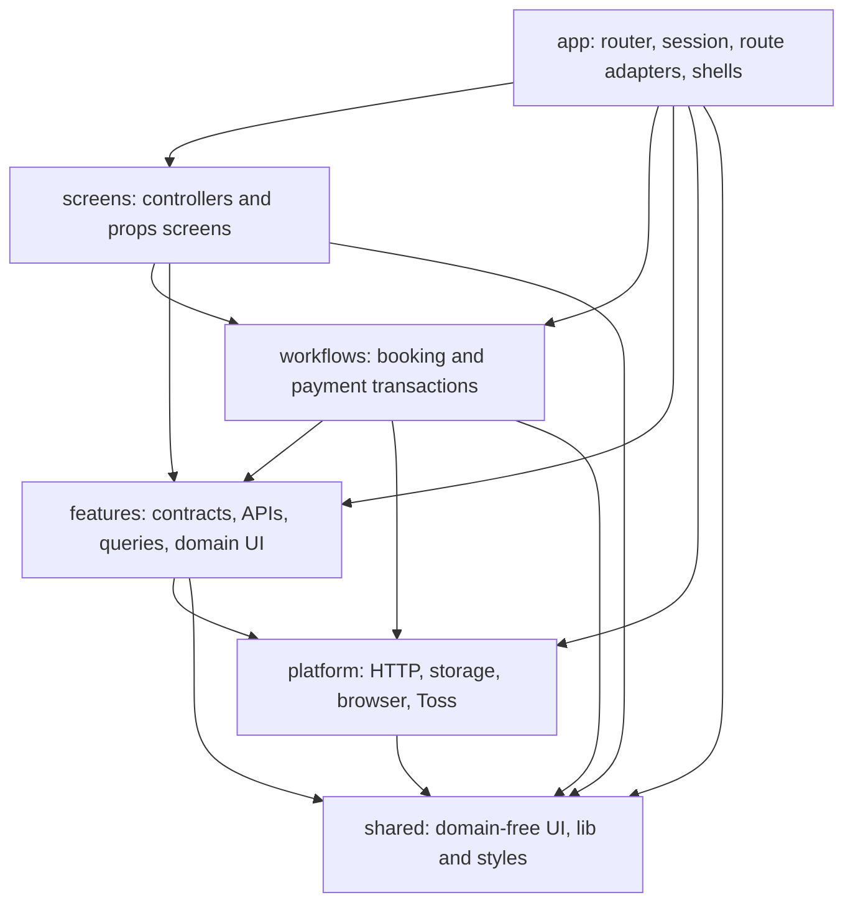
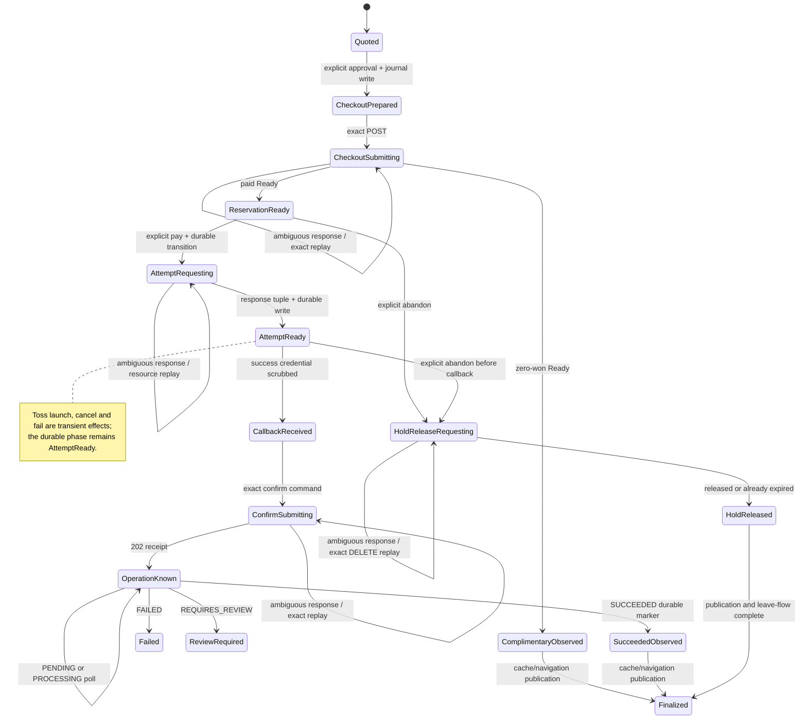
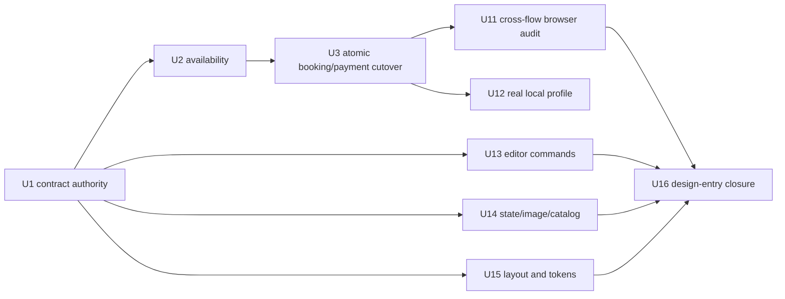

# refactor: Align Airbob frontend with local backend contracts before redesign

## Summary

현재 frontend dependency DAG와 route/screen/workflow 경계는 유지한다. 먼저 최신 로컬 backend V1 계약에 맞춰 availability, quote/checkout, payment-attempt와 async payment operation을 재구축하고, 그 뒤 Airbnb 디자인에 필요한 semantic UI, layout, responsive/runtime token 경계를 닫는다.

OCI, Vercel, AWS와 실제 Airbnb visual restyling은 이번 계획의 완료 조건이 아니다. Backend/API/DB/server 코드는 read-only reference이며 수정하지 않는다.

## Problem Frame

[2026-09-01 재감사](../qa/2026-09-01-frontend-architecture-local-backend-readiness-audit.md)는 최근 frontend 변경이 같은 구조를 임의로 뒤집은 것이 아니라 `pages → app route adapter + screens`, CRA→Vite, Jest→Vitest, Axios→native HTTP로 수렴한 과정이라고 판정했다. 현재 architecture, structure와 deterministic browser gate도 green이다.

그러나 backend는 frontend 안정화 이후 availability split, quote-only checkout, reservation idempotency, payment-attempt token과 async payment operation을 도입했다. 현재 frontend는 detail의 `unavailable_dates`를 spread하고, reservation을 직접 생성하며, payment attempt 없이 confirm을 보내고, 202 Accepted를 성공으로 처리한다. 이 상태에서 디자인을 크게 바꾸면 contract failure와 visual regression을 동시에 추적해야 한다.

이번 계획은 기존 architecture를 또 갈아엎지 않는다. Current V1 contract를 feature adapter에 반영하고 booking/payment state machine을 exact-replay 가능한 transaction으로 바꾼 뒤, 확인된 pre-design boundary만 작은 vertical unit으로 정리한다.

## Scope Boundaries

### In Scope

- Frontend current HEAD와 read-only local backend HEAD 사이의 공개 V1 contract matrix를 고정한다.
- Accommodation detail과 availability resource를 분리하고 half-open date/window semantics를 적용한다.
- Reservation quote, explicit review, idempotent checkout와 0-won direct-confirmed branch를 구현한다.
- `Idempotency-Key`를 위한 narrow HTTP capability와 subject-owned booking journal v2를 도입한다.
- Payment-attempt issuance, pre-confirm hold release, Toss sandbox launch와 callback claim을 최신 계약에 맞춘다.
- Payment confirm 202 receipt, exact replay, operation polling, failure/review recovery를 구현한다.
- Guest/host reservation status와 read model을 backend current enum/fields에 맞춘다.
- Unit, architecture, deterministic Playwright와 real local-backend verification을 갱신한다.
- Editor command, image/state owner, shell/container, responsive/runtime token, amenity catalog와 large visual section 경계를 정리한다.
- Architecture, browser-data, QA, project overview와 historical plan 문서를 current state로 갱신한다.

### Out of Scope

- `../airbob`의 Java, configuration, DB migration, API, cookie, CORS, Kafka, infrastructure 또는 server logic 수정
- Backend source codegen, cross-repo runtime import 또는 frontend build가 backend checkout에 의존하는 구성
- Post-payment reservation cancellation UX와 `RETRY_CANCELLATION` 처리
- New Redux, Zustand, XState 또는 general-purpose global store
- Route path와 public query key의 제품 목적 변경
- Production OCI deployment, Vercel→OCI cookie/CORS, AWS performance 또는 Maps production key 검증
- 실제 Airbnb color, typography, spacing, illustration과 page restyling
- Backend에 없는 cross-device payment-operation lookup을 frontend만으로 약속하는 것

### Deferred Follow-Up

- Airbnb visual redesign은 이 계획의 design-entry closure 뒤 vertical slice 계획으로 실행한다.
- Vercel/OCI canary는 backend deployment와 cross-site cookie policy가 준비된 뒤 별도 gate로 실행한다.
- AWS 성능 분석은 functional contract와 local integration이 안정된 뒤 수행한다.
- General reservation cancellation은 backend cancel operation과 별도 product flow로 계획한다.

## Requirements

### Architecture and Contract Authority

- R1. Current `app → screens/workflows/features/platform/shared` dependency direction과 15개 route path를 보존한다.
- R2. Parent `accommodations`를 포함한 발견된 모든 feature scope가 strict architecture registry와 정확히 일치해야 한다.
- R3. Frontend는 implementation 시작 시 backend public V1 contract revision을 기록하고 backend repository를 read-only로 취급해야 한다.
- R4. Obsolete direct reservation, pre-U10 browser compatibility와 immediate-payment-success 문서는 current source of truth에서 제거해야 한다.
- R5. 각 implementation unit은 하나의 cohesive boundary—contract, user flow 또는 named pre-design boundary bundle—를 land하며 unrelated formatting/tooling sweep를 포함하지 않아야 한다.

### Availability and Quote

- R6. Accommodation detail은 `timeZoneId`를 소유하고 availability는 별도 resource로 조회해야 한다.
- R7. Availability range와 booking window는 `[start, endExclusive)` 규칙을 사용해야 한다.
- R8. Availability failure는 detail content를 숨기지 않지만 reservation CTA를 막고 retry를 제공해야 한다.
- R9. Frontend availability는 UX guard이며 quote가 price, inventory eligibility와 booking policy의 server authority여야 한다.
- R10. Detail reservation action은 quote를 만들고 current confirmation route에서 server price와 expiry를 보여준 뒤 별도 checkout 승인을 받아야 한다.
- R11. Quote expiry 또는 stale response 뒤에는 새 quote를 보여주고 checkout 승인을 다시 받아야 한다.

### Checkout and Reservation

- R12. Checkout 전에 exact request body, stable idempotency key, subject owner와 quote identity를 durable booking journal에 기록해야 한다.
- R13. Checkout network/timeout/response ambiguity는 같은 quote, request body와 idempotency key로만 replay해야 한다.
- R14. R016 idempotency conflict는 fail closed하고 새 key를 자동 생성하지 않아야 한다.
- R15. R020 already-checked-out 상태는 새 reservation을 자동 생성하지 않고 guest trips 확인으로 안내해야 한다.
- R16. Server Ready response는 quote와 date, guest, amount, currency, payment flags, status와 expiry invariant를 검증해야 한다.
- R17. 0-won Ready는 payment-attempt, Toss, callback, confirm을 호출하지 않고 confirmed reservation detail로 이동해야 한다.
- R18. Reservation read model은 backend current status와 recovery fields를 exhaustive하게 표현하고 unknown wire values를 거부해야 한다.

### Payment and Recovery

- R19. Toss SDK 준비는 미리 할 수 있지만 payment-attempt는 명시적 payment click 뒤와 Toss request 직전에 발급해야 한다.
- R20. Payment-attempt response를 journal에 기록하지 못하면 Toss를 열지 않아야 한다.
- R21. Payment-attempt response loss는 같은 endpoint replay로 동일 미소비 attempt를 회수해야 한다.
- R22. Success와 fail callback credential은 auth/session child가 render되기 전에 URL과 history에서 제거해야 한다.
- R23. Raw provider message와 paymentKey는 app-controlled telemetry, console, storage inventory, test artifact 또는 사용자 copy에 남지 않아야 하며 pre-bootstrap hosting log 한계는 deployment security gate에 기록해야 한다.
- R24. Confirm은 `paymentAttemptId`를 포함하고 202 Accepted receipt를 반환해야 하며 Accepted 자체를 성공으로 보지 않아야 한다.
- R25. Confirm response ambiguity는 동일한 paymentKey, orderId, amount와 paymentAttemptId로만 replay해서 같은 operation ID를 회수해야 한다.
- R26. Payment operation은 `PENDING`, `PROCESSING`, `SUCCEEDED`, `FAILED`, `REQUIRES_REVIEW`와 `nextAction`을 exhaustive하게 처리해야 한다.
- R27. `SUCCEEDED`만 success cleanup을 허용하고 `FAILED`, `REQUIRES_REVIEW`와 poll network error는 recoverable evidence를 보존해야 한다.
- R28. Polling은 server retry hint를 2~30초로 clamp하고 route/session departure에서 중지하며 reload 뒤 same-tab receipt로 재개해야 한다.
- R29. Hold release는 paid `PAYMENT_PENDING` checkout에서 confirm submission 전 사용자가 명시적으로 포기한 경우만 허용해야 한다.

### State, Identity, Privacy and Errors

- R30. Booking journal, callback credential과 payment operation receipt는 purpose와 sensitivity에 따라 분리해야 한다.
- R31. New browser records는 exact field allowlist, schema version, subject owner, created/expiry, forward-only phase transition과 cleanup policy를 가져야 한다.
- R32. 기존 booking-payment v1 record는 새 contract로 migrate하지 않고 v2 activation 전에 purge하며 purge 실패 시 replay-sensitive mutation을 차단해야 한다.
- R33. Subject/epoch가 바뀐 async completion은 effect를 수행하지 않아야 하며 same-subject reauthentication recovery는 새 epoch lease를 명시적으로 발급해야 한다.
- R34. Sensitive callback state를 BroadcastChannel 또는 cross-tab localStorage로 공유하지 않아야 한다.
- R35. R016–R026와 P005–P007은 generic conflict 하나가 아니라 workflow action으로 분류돼야 한다.

### Verification and Design Entry

- R36. Every feature-bearing unit은 happy path, validation, ambiguous response, stale route/session과 terminal error를 focused test로 보호해야 한다.
- R37. Deterministic Playwright는 unhandled network default-deny와 redacted artifact policy를 유지하면서 모든 booking/payment branch를 재현해야 한다.
- R38. Real local integration은 Vite proxy와 current local backend full messaging stack을 사용해야 한다.
- R39. Local verification은 Vercel/OCI cookie, production CORS, Maps quota 또는 cross-device recovery를 증명한다고 표시하지 않아야 한다.
- R40. Existing custom smoke는 Playwright local profile이 동등한 coverage와 redaction을 가질 때까지 제거하지 않아야 한다.
- R41. Editor screen contract는 React setter 대신 named semantic command를 노출해야 한다.
- R42. Page width/gutter, image fallback, loading/error/empty state, responsive alias와 runtime design literal은 각각 하나의 owner를 가져야 한다.
- R43. Amenity taxonomy와 visual catalog는 accommodation domain이 소유하고 detail/editor가 중복 registry를 유지하지 않아야 한다.
- R44. Airbnb visual work는 contract, architecture, deterministic browser와 pre-design boundary gate가 green인 뒤 시작해야 한다.
- R45. Frontend는 backend의 existing cookie-session과 CSRF/Origin contract를 따라야 하며 임의 token scheme을 만들거나 local proxy 성공을 cross-site mutation 방어 증거로 간주하지 않아야 한다.
- R46. Provider/backend message, `statusUrl`, request message와 internal failure detail은 transport-only untrusted data이며 allowlisted enum/code/identifier만 domain과 UI에 진입해야 한다.

## Key Technical Decisions

- KTD1. **Preserve the current DAG:** 재감사에서 app, screen, workflow, feature, platform, shared 경계와 gate가 green이므로 새 layer나 global store를 도입하지 않는다.
- KTD2. **Treat backend as a read-only contract source:** `../airbob@b2ec09a`는 planning snapshot이며 implementation 시 current public V1 delta만 다시 읽는다. Backend를 frontend 편의에 맞게 수정하지 않는다.
- KTD3. **Availability is advisory; quote is authoritative:** Availability는 date-picker UX를 돕지만 경쟁, price, coupon과 policy의 최종 판정은 quote/checkout response가 가진다.
- KTD4. **Reuse the current confirmation route for explicit quote review:** `/accommodations/:id/confirm`과 booking query를 보존하고, detail action은 quote를 만든 뒤 이 화면에서 server price를 확인시킨다. Checkout은 두 번째 명시적 action이다.
- KTD5. **Generate idempotency once at the workflow boundary:** Platform의 cryptographic ID factory를 workflow dependency로 주입하고 `checkout-prepared` 전이에서 한 번 생성한다. Feature adapter는 backend 형식을 검증하고 HTTP core는 arbitrary headers를 열지 않은 채 exact header로 직렬화한다.
- KTD6. **Hard-cut booking storage to v2 before activating the writer:** Old records에는 quote, idempotency key, attempt와 backend operation ID가 없어 dual-read/migration하지 않는다. Retired-key purge와 read-back이 실패하면 v2 mutation을 막고, activation 뒤 rollback은 pre-v2 build가 아니라 마지막 v2-compatible build로만 한다.
- KTD7. **Classify mutation recovery by backend guarantee:** Quote는 inventory를 잡지 않아 response loss 뒤 fresh request가 가능하다. Checkout은 exact body/key, attempt와 release는 exact reservation resource command, confirm은 exact four-field tuple만 replay한다. Replay-sensitive mutation은 request 전에 prepared/submitting phase를 기록한다.
- KTD8. **Model zero-won checkout as a terminal reservation branch:** Amount가 0인 정상 Ready는 payment workflow에 들어가지 않으며 amount-positive storage validation을 우회하는 예외가 아니다.
- KTD9. **Issue the attempt after SDK preparation but before gateway launch:** SDK loading 때문에 hold 시간을 소비하지 않되, attempt tuple 저장 뒤에는 다른 network await 없이 Toss를 호출한다.
- KTD10. **Separate callback credential from the subject-owned transaction receipt:** Pre-auth credential은 memory-only다. Matching subject/journal claim 뒤에는 exact-replay를 위해 15분 hard-TTL session record로 저장하고 Accepted receipt write/read-back이 성공한 뒤에만 삭제한다. Credential-free operation/reservation receipt도 personal transaction data이며 24시간 hard TTL 또는 final UI acknowledgment까지 보존한다.
- KTD11. **Backend operation ID is payment authority and transport text is untrusted:** Payment adapter는 `statusUrl`, provider/backend message, request message와 internal failure detail을 폐기한다. Validated UUID와 known enum/code만 workflow에 넘기고 frontend allowlist가 사용자 문구를 만든다. `SUCCEEDED`만 durable success marker를 허용한다.
- KTD12. **Guarantee same-tab recovery, not impossible cross-device recovery:** Session storage와 subject/epoch fence를 유지하고 duplicated/opener tab에 record가 복제될 수 있음을 threat model에 포함한다. 다른 tab/device는 backend conflict와 reservation final state로 수렴하며 operation-specific next action은 약속하지 않는다.
- KTD13. **Hold release stops at the confirm boundary:** Quote-only cleanup은 local이고 paid hold는 사용자가 포기할 때만 release한다. Callback 수신 또는 confirm submission 뒤에는 release하지 않는다.
- KTD14. **Keep three verification tiers honest:** Deterministic browser, real local-backend/sandbox, Vercel/OCI deployment evidence를 별도 gate로 유지한다.
- KTD15. **Use PageContainer for width and gutter:** Shell은 route surface, header policy와 main landmark를 유지하고 shared `PageContainer` recipe가 screen별 width/gutter variant를 소유한다.
- KTD16. **Keep domain catalog above subfeatures without violating the DAG:** Parent accommodation feature가 semantic catalog를 export하고 screen/controller composition이 detail/editor에 전달한다. Nested feature끼리 import하지 않는다.
- KTD17. **Prepare design boundaries without restyling:** Editor commands, state/image recipes, layout, responsive/runtime tokens와 stable view sections까지만 이 계획에 포함한다.
- KTD18. **Use one atomic production cutover for the coupled booking/payment writer:** Read-side and design-boundary units는 독립 land한다. Quote/checkout, journal v2, attempt, callback, Accepted/polling writer는 U3 내부 checkpoint로 작은 commit을 만들 수 있지만 U3 전체가 green이 되기 전 production merge/deploy하지 않는다.
- KTD19. **Make transaction identity immutable and phases monotonic:** One subject-owned document는 `flowId + subject + epoch + expected prior phase`가 일치할 때만 full-record replacement를 허용한다. Accommodation/date/guest/quote/key/reservation/amount/currency/attempt/operation tuple은 이후 단계에서 변경할 수 없고 terminal/purge 뒤 stale completion이 record를 되살릴 수 없다.
- KTD20. **Durably observe server terminal before UI publication:** Complimentary Ready와 payment `SUCCEEDED`는 먼저 terminal marker로 기록하고 cache refresh/navigation을 수행한다. Publication이나 cleanup 실패는 server terminal을 되돌리거나 mutation replay를 유발하지 않는다.
- KTD21. **Do not invent frontend CSRF:** Cookie-session mutation은 backend의 documented CSRF/Origin policy를 따른다. Policy 부재나 arbitrary Origin 허용은 backend 변경 요청이 아니라 Vercel/OCI integration blocker로 남긴다.
- KTD22. **Keep runtime token data pure:** Canonical token names/values는 `shared/styles`가 소유한다. DOM/CSSOM reader가 필요하면 `platform/browser`가 좁은 port로 제공하며 shared/screens가 `document` 또는 `getComputedStyle`을 직접 읽지 않는다.

## High-Level Technical Design

### Preserved dependency topology



Parent `accommodations`는 feature capability지만 nested detail/listing-editor와 직접 import 관계를 만들지 않는다. Screen/controller가 parent catalog와 nested feature view를 조립한다.

### Booking and payment sequence

```mermaid
sequenceDiagram
  actor Guest
  participant Detail as Detail screen
  participant Booking as Booking workflow
  participant Reservation as Reservation feature API
  participant Journal as Subject-owned journal v2
  participant Confirm as Confirmation screen/workflow
  participant Toss as Toss sandbox SDK
  participant Payment as Payment feature API

  Detail->>Reservation: Read detail and separate availability
  Guest->>Detail: Request quote
  Detail->>Booking: Submit booking intent with route/session lease
  Booking->>Reservation: POST reservation quote
  Reservation-->>Booking: Server price, currency and quote expiry
  Booking->>Journal: Store quoted intent
  Booking-->>Detail: Navigate command for existing confirmation route
  Guest->>Confirm: Explicitly approve checkout
  Confirm->>Booking: Approve quoted flow
  Booking->>Journal: Store exact body and idempotency key
  Booking->>Reservation: POST checkout with Idempotency-Key
  Reservation-->>Booking: Ready
  alt Complimentary reservation
    Booking-->>Guest: Open confirmed reservation detail
  else Paid reservation
    Guest->>Confirm: Click pay
    Confirm->>Booking: Start payment for current flow
    Booking->>Journal: Persist attempt-requesting phase
    Booking->>Reservation: POST payment-attempt
    Reservation-->>Booking: attempt ID, exact order tuple and hold time
    Booking->>Journal: Persist attempt before gateway launch
    Booking->>Toss: Request sandbox payment
    alt Success callback
      Toss-->>Confirm: Redirect authorization tuple
      Confirm->>Journal: Scrub URL and claim short-lived credential
      Confirm->>Booking: Resume matching flow
      Booking->>Payment: POST confirm with attempt ID
      Payment-->>Booking: 202 operation receipt
      Booking->>Journal: Write/read-back receipt, then purge credential
      loop PENDING or PROCESSING
        Booking->>Payment: GET validated operation ID
        Payment-->>Booking: Status, nextAction and retry hint
      end
      Booking-->>Guest: Succeed, restart, reservation status or support state
    else Fail or user cancel callback
      Toss-->>Confirm: Redirect fail/cancel data
      Confirm->>Journal: Scrub URL; keep attempt-ready flow
      Confirm-->>Guest: Offer same-attempt retry or explicit hold release
    end
  end
```

### Persistent transaction phases



`Finalized`만 normal cleanup을 수행한다. `SucceededObserved`에서 publication이 실패하면 terminal marker와 receipt를 보존하고 confirm을 다시 보내지 않는다. `Failed`와 `ReviewRequired`는 payment credential은 제거할 수 있지만 reservation/operation receipt는 결과와 next action을 표시할 때까지 보존한다.

### Immutable transaction identity

| First established | Immutable fields checked by later phases                                         |
| ----------------- | -------------------------------------------------------------------------------- |
| Booking intent    | accommodation, calendar-local dates, adult/child guest count and coupon identity |
| Quote             | quote UID, server amount/currency, expiry and exact checkout body                |
| Checkout prepared | cryptographic idempotency key and flow ID                                        |
| Ready             | reservation UID/order ID, amount/currency, payment flags and hold expiry         |
| Attempt ready     | payment-attempt ID and exact Ready tuple                                         |
| Callback claimed  | paymentKey plus matching order ID/amount/attempt/flow                            |
| Operation known   | backend operation ID plus matching reservation/order ID                          |

한 필드라도 다르면 이후 mutation, navigation, cache publication과 cleanup은 모두 0회다. Harness는 synthetic key 값을 출력하지 않고 첫 command와 replay의 in-memory equality 또는 one-way fingerprint equality를 검증한다.

### Browser-state retention and replacement

| Record                       | Retention                                                            | Transition rule                                                                 |
| ---------------------------- | -------------------------------------------------------------------- | ------------------------------------------------------------------------------- |
| Pre-auth callback claim      | Current document memory only                                         | URL scrub 뒤 보관; stable same-subject journal 확인 전 API 호출 금지            |
| Claimed callback credential  | 15-minute hard TTL in same-tab session storage                       | Accepted receipt write/read-back 전 삭제 금지                                   |
| Booking transaction document | Server expiry-aware with 60-minute hard cap before operation receipt | Full-record forward-only replacement; new flow cannot overwrite unresolved flow |
| Operation/terminal receipt   | 24-hour hard TTL or final UI acknowledgment                          | Credential-free but subject-owned; terminal publication 실패 시 보존            |

Session storage가 duplicated/opener tab에 복제될 수 있으므로 record 자체를 신뢰하지 않는다. 모든 read에서 schema, tuple, subject, epoch, TTL과 expected phase를 다시 검증하고 backend conflict를 cross-tab authority로 사용한다.

### Error-to-action contract

| Backend code or condition | Frontend action                                              |
| ------------------------- | ------------------------------------------------------------ |
| R016                      | Journal/request mismatch로 fail closed; new key 금지         |
| R017/R018/R019            | Fresh quote를 요청하고 다시 승인받기                         |
| R020                      | 새 checkout 금지; guest trips 확인 안내                      |
| R021                      | Reservation detail을 조회해 current state로 수렴             |
| R022                      | Payment 시작 시간이 부족함; hold release 후 fresh quote      |
| R023/R024                 | New attempt 금지; reservation state 조회                     |
| R025/R026                 | Retryable inventory state; availability/quote refresh        |
| P005                      | Receipt가 stale/invalid; reservation state 조회              |
| P006                      | Different confirm tuple security conflict; retry 금지        |
| P007                      | Operation polling/confirmation을 retryable로 유지            |
| Poll network error        | Payment failure로 확정하지 않고 receipt 보존                 |
| `START_NEW_CHECKOUT`      | Old tuple을 버리고 fresh quote부터 시작                      |
| `CONTACT_SUPPORT`         | Operation/reservation identifier만 보존해 support state 표시 |
| `NONE`                    | Reservation detail이 최종 사용자 설명의 authority            |

## Implementation Units

### Unit dependency graph



U2와 U13–U15는 U1 뒤 병렬 실행할 수 있다. U3 내부 checkpoint는 작은 commit과 focused test로 진행하지만 U3 전체가 green이 되기 전 production branch에 merge/deploy하지 않는다. U12는 backend-owned fixture와 local infrastructure가 준비됐을 때 실행하며 U16 또는 backend-independent design entry를 막지 않는다.

### U1. Close contract authority and architecture registry gaps

- Outcome: current architecture와 backend contract snapshot이 하나의 실행 기준을 갖고 parent `accommodations`가 다른 feature와 같은 strict rule을 받는다.
- Requirements: R1–R5, R39, R44.
- Files:
  - Modify `architecture-ratchet.json`.
  - Modify `tests/architecture/verify-registry-rules.mjs` and relevant architecture fixtures.
  - Modify `docs/architecture/current-frontend-architecture.md`, `docs/architecture/frontend-migration-rules.md`, `tests/architecture/dependency-rules.md`, `docs/qa/frontend-target-contract-matrix.md`, `PROJECT_OVERVIEW.md` and `docs/archive/frontend-refactor-plan-index.md`.
  - Add a current-target caveat to `docs/solutions/workflow-issues/frontend-architecture-verification-loop.md`.
- Approach: Register the parent scope and assert discovered feature scopes equal the ratchet registry in both directions. Mark the 2026-08-29 plan as historical/superseded through the plan index and current docs; do not reintroduce retired payment compatibility.
- Test scenarios:
  - The registry passes when all 11 current feature scopes are present.
  - A fixture with an unregistered parent or nested feature fails with the missing scope named.
  - A stale registry entry fails instead of silently keeping dead policy.
- Verification: Architecture gate reports the same dependency direction for parent and nested accommodation scopes; docs no longer claim live OCI or retired v1 compatibility as a design prerequisite.

### U2. Split accommodation detail from availability

- Outcome: Detail renders independently while booking controls use current availability window/ranges and timezone semantics.
- Requirements: R6–R9, R36.
- Files:
  - Modify `src/features/accommodations/detail/api/contracts.ts`, `mappers.ts`, `model/accommodationDetail.ts`, current API/query/public files and their tests.
  - Add availability wire/model/port/API/query files under `src/features/accommodations/detail`.
  - Modify `src/screens/accommodation-detail/AccommodationDetailController.tsx`, its booking command/view contracts and focused tests.
  - Modify domain-free disabled-range inputs in `src/shared/ui/DatePicker` only if the current contract cannot express half-open ranges.
- Approach: Remove `unavailable_dates` from detail mapping, add `timeZoneId`, and query `/accommodations/{id}/availability` separately. Keep dates as calendar-local values; do not convert them through the browser timezone. Disable checkout only when availability is missing/invalid or the selected stay overlaps a range.
- Test scenarios:
  - Checkout equal to an unavailable range start is allowed when the stay ends there.
  - Any night inside `[startDate,endDateExclusive)` is blocked.
  - Checkout equal to booking-window end is allowed while check-in on that date is not.
  - Detail remains visible when availability returns R026, network failure or malformed data; booking CTA offers retry.
  - Stale accommodation/session results cannot update the current screen.
- Verification: Existing detail route/query behavior remains stable and no detail mapper reads `unavailable_dates`.

### U3. Atomically cut over the booking and payment critical section

- Outcome: One production revision switches the only booking/payment writer from direct-create/immediate-success to quote, v2 journal, idempotent checkout, payment-attempt, scrubbed callback and async operation recovery.
- Dependencies: U1 and U2. Backend public V1 snapshot must still match the audit before composition switches.
- Requirements: R9–R37, R45–R46.
- Landing boundary: Internal checkpoints A–H may compile and pass focused tests on the branch, but obsolete adapters, storage readers and route composition remain active until every new capability and matching deterministic browser scenario is ready. The final owner switch removes the old writer and retired v1 surface in the same revision.
- Overall verification: No intermediate build can create a paid hold without a working attempt/callback/operation path. Architecture, structure and browser gates pass at the final switch, and rollback targets only a previously complete v2-compatible build.

#### Checkpoint A — Reservation contracts and narrow HTTP idempotency

- Checkpoint outcome: Feature adapters match current V1 quote/checkout Ready contracts and can send only a validated `Idempotency-Key` header.
- Files:
  - Add parallel quote/checkout capability files and tests while retaining active `src/features/reservations/api/reservationCreate*`, `model/reservationCreate.ts` and `ports/reservationCreateApiPort.ts` until the final owner switch.
  - Modify `src/features/reservations/public.ts`.
  - Modify `src/platform/http/request.ts`, `clientCore.ts` and their tests.
  - Modify `tests/e2e/fixtures/api.ts` and harness security tests.
- Approach: Model Quote and Ready as separate validated domain responses. Keep wire types, mappers and concrete HTTP adapters private; workflows consume narrow ports and validated domain results only. A platform cryptographic factory creates the key once, the workflow binds it to method/endpoint/subject/quote/exact-body fingerprint, the feature validates the backend 8–128 contract and HTTP core emits the header. Preserve `requestMessage` as `null` and discard returned request/failure text in this plan.
- Test scenarios:
  - Quote maps price breakdown, currency, flags, expiry and server time.
  - Ready accepts exactly the complimentary and paid invariant combinations.
  - Invalid UUID, status, currency, time or flag combinations fail before workflow publication.
  - HTTP core emits one `Idempotency-Key` header and rejects malformed values.
  - StrictMode, double click, reload and ambiguous replay reuse the same in-memory key/fingerprint without printing the key.
  - A canary key is absent from console, error cause, trace/report and request-dump artifacts while the harness still proves first/replay equality.
  - Feature public-surface tests reject wire contracts, mapper, concrete API and query-key exports.
- Verification: No production caller retains the direct-create accommodation/date payload for `POST /reservations`, and root public surfaces expose only composition ports/domain types.

#### Checkpoint B — Subject-owned booking journal v2

- Checkpoint outcome: Every replay-sensitive booking command has durable same-tab recovery data before it is sent, while callback credentials remain short-lived.
- Requirements: R12–R13, R20, R25, R28, R30–R34.
- Files:
  - Rework `src/workflows/booking-payment/checkout/types.ts`, `repositories.ts`, `validation.ts` and their tests.
  - Modify `src/platform/storage/bookingPaymentStorageDriver.ts` and booking cleanup/session tests.
  - Add explicit journal, callback credential and operation receipt contracts under `src/workflows/booking-payment`.
  - Modify `docs/architecture/frontend-browser-data-inventory.md`.
- Approach: Create one full-record, forward-only transaction document plus a separate callback credential record. Quote is safe to record after response; checkout-prepared, attempt-requesting, release-requesting and confirm-submitting are persisted before replay-sensitive mutation. Every replacement checks flow, subject, epoch and expected prior phase. V1 exact keys are purged and verified before v2 activation; unrelated prefixes remain untouched.
- Test scenarios:
  - A prepared/submitting write failure before checkout, attempt, release, Toss or confirm blocks the external command.
  - Expired, malformed, wrong-subject and wrong-epoch records are purged without publication.
  - Complimentary records allow amount 0 only with the matching confirmed invariant.
  - Lower-phase, different-flow, terminal-resurrection and StrictMode duplicate writes are rejected.
  - Receipt write/read-back failure preserves the callback credential; credential purge failure after receipt leaves polling authoritative and triggers opportunistic purge without re-confirm.
  - V1+v2 coexistence, prefix collision, partial remove failure and retry never expose or migrate the v1 payload.
  - Account switch removes the old subject record and late completion writes nothing.
- Verification: Browser-data inventory names purpose, exact fields, sensitivity, hard TTL, owner, legal transitions and terminal cleanup for every record. V2 activation is impossible while retired-key cleanup is incomplete.

#### Checkpoint C — Quote review, idempotent checkout and the zero-won branch

- Checkpoint outcome: The existing accommodation confirmation route becomes an explicit server-quote review and safe checkout flow.
- Requirements: R8–R17, R33, R35–R36.
- Files:
  - Build new quote/checkout workflow ownership beside active `src/workflows/booking-payment/reservation-create`; remove direct-create behavior only in the final owner switch.
  - Modify `src/screens/accommodation-detail/useReservationCreateCommand.ts`, detail controller/tests and rename contracts where clarity requires it.
  - Modify `src/app/router/routes/AccommodationDetailRoute.tsx`, `ReservationConfirmRoute.tsx` and route tests.
  - Modify `src/screens/reservation-confirm` controller, view model, screen and tests.
- Approach: Screen/controller emits user intent; the booking workflow owns quote, checkout, key generation, journal transition and cache commands. App route adapter injects route/session leases and executes returned navigation commands. The unchanged confirm path displays server price/expiry and requires a second click. On ambiguous checkout, expose exact replay; never create a new key. Complimentary Ready is durably marked before best-effort cache publication/navigation.
- Test scenarios:
  - Double click produces one quote or one checkout command per phase.
  - Quote response loss allows a fresh quote because no inventory was held.
  - Checkout response loss replays the same body/key and receives the same reservation.
  - Checkout succeeds after quote expiry and exact replay still resolves the original reservation.
  - R016 and R020 produce no second checkout with a new key.
  - R018/R019 return to a refreshed quote that requires user approval again.
  - Zero-won Ready performs no payment API or Toss call and navigates to reservation detail.
  - Complimentary cache/navigation failure retains the terminal marker and never repeats checkout.
  - Auth resume, route departure and session change preserve the existing stale-result fences.
- Verification: Current route URLs remain stable, all charged values are server-authoritative, and ownership tests reject API/storage/Router imports from props screens or injected-workflow binding hooks.

#### Checkpoint D — Reservation read models and status presentation

- Checkpoint outcome: Reservation lists/details can describe current backend states and support safe final-status fallback without lying status aliases.
- Requirements: R18, R27–R29, R35–R36.
- Files:
  - Modify `src/features/reservations/api/reservationReadContracts.ts`, mappers/models, query/cache projection and tests.
  - Modify reservation status/display/view-model files under `src/features/reservations/lib`.
  - Modify guest/host panels and `src/screens/reservation-detail` screen/controller tests as required.
- Approach: Replace `PAYMENT_COMPLETED`/`COMPLETED` with current backend status enum. Add validated `paymentAllowed`, hold/server time and timezone fields. Discard raw `requestMessage` until a product flow needs and validates it. Derive past-stay presentation from dates instead of inventing a server status.
- Test scenarios:
  - All seven backend reservation statuses map exhaustively.
  - Unknown status is rejected rather than rendered as raw text.
  - PAYMENT_PROCESSING and CANCELLATION_PENDING never show a new-payment CTA.
  - Complimentary confirmed reservation has no payment object but renders as confirmed.
  - Server-time/hold values produce stable countdown or expired presentation independent of browser clock skew.
  - A missing operation receipt opens reservation ownership/final status only and creates no new attempt, confirm or operation poll.
- Verification: Guest detail is a final reservation ownership/status fallback, not a reconstruction path for operation ID, nextAction or confirm replay.

#### Checkpoint E — Payment-attempt and pre-confirm hold release

- Checkpoint outcome: Toss is opened only with a server-issued attempt, and a user can explicitly abandon a pending hold before confirmation.
- Requirements: R19–R21, R29, R33, R35–R36.
- Files:
  - Add attempt and hold-release contracts/API/model/ports under `src/features/reservations/payment` with tests.
  - Modify `src/workflows/booking-payment/checkout/paymentRequest.ts`, gateway/repository contracts and tests.
  - Modify reservation-confirm/fail controller and screen contracts for retry versus abandon actions.
- Approach: Prepare the Toss SDK before the pay click. Attempt issuance and release share the transaction’s single command lane. Persist `attempt-requesting` or `release-requesting` with exact reservation identity before the request, validate the response tuple, then advance. Persist attempt-ready before Toss and launch without another network wait. Release is explicit before callback/confirm and never relies on unload cleanup.
- Test scenarios:
  - Attempt response loss replays the endpoint and recovers the same ID.
  - Attempt-requesting reload replays the same reservation endpoint and cannot create a second flow.
  - Journal write failure makes Toss call count zero.
  - Synchronous SDK cancel/load failure leaves the same unconsumed attempt eligible for explicit retry.
  - R022 moves to hold release/fresh quote; R023/R024 query reservation state instead of inventing a new attempt.
  - Release timeout safely replays DELETE; release conflict after PAYMENT_PROCESSING switches to payment recovery.
  - Release/pay simultaneous clicks select one command lane; late success callback after release makes zero confirm calls.
  - Confirm-submitting or operation-known state exposes no release command.
- Verification: No Toss request exists without a validated attempt persisted for the same reservation tuple.

#### Checkpoint F — Success/fail callback credential capture

- Checkpoint outcome: Provider credentials are removed before child rendering and can only be claimed by the matching booking/session.
- Requirements: R22–R23, R30–R34, R36.
- Files:
  - Modify `src/app/router/PaymentCallbackCredentialBoundary.tsx` and tests.
  - Modify `src/app/router/codecs/paymentCodec.ts`, success/fail route codecs and tests.
  - Modify callback claim/repository files under `src/workflows/booking-payment/confirmation`.
  - Modify artifact-sensitive text policy under `tests/e2e/support`.
  - Modify pre-bootstrap referrer policy in `index.html` and deployment headers where supported without changing backend behavior.
- Approach: Detect a dedicated callback route and unconditionally replace its entire search/hash with the canonical no-query path before parsing, telemetry or third-party initialization. Parse only the captured in-memory string afterward. Keep the pre-auth claim in memory, then create a new epoch recovery lease and short-lived session credential only when stable subject and journal owner match. A different subject purges it. Provider messages map to allowlisted frontend copy.
- Test scenarios:
  - Success and fail URLs/history contain no credential after the boundary runs.
  - Malformed encoding, duplicate keys, missing tuple members, oversized text and parser exceptions still scrub the full URL and cannot reappear through back/forward.
  - Mismatched order/amount makes zero confirm calls but preserves the valid journal.
  - Anonymous callback resumes only after the original subject authenticates.
  - Same subject after a new epoch receives a new recovery lease; old async work remains fenced.
  - Another user login exposes no previous callback or reservation data.
  - Reload without attempt/journal fails closed and routes to server-owned reservation history.
- Verification: Callback browser cases run in an artifact-isolated profile with trace/HAR/video/network URL recording disabled before credential navigation. App-controlled outputs remain clean; unavoidable hosting/access-log query exposure is recorded as a deployment blocker rather than claimed solved by SPA scrub.

#### Checkpoint G — Payment Accepted receipts and operation reads

- Checkpoint outcome: Payment feature ports expose current 202/operation contracts instead of `Promise<void>`.
- Requirements: R24–R28, R35–R36.
- Files:
  - Modify `src/features/reservations/payment/api/contracts.ts`, mappers, `paymentApi.ts`, model, ports, public surface and tests.
  - Add payment-operation read capability under the same feature boundary.
- Approach: Confirm includes `paymentAttemptId` and returns a validated Accepted receipt. Private API adapter discards `statusUrl`, user/backend message and internal failure detail, then builds reads from the validated UUID. Workflow receives only operation/reservation identity, known status/nextAction, allowlisted user-failure code, server time and retry hint.
- Test scenarios:
  - 202 Accepted returns the operation ID instead of being discarded.
  - Exact confirm replay maps to the same operation ID.
  - P006 becomes a non-retryable tuple conflict.
  - Unknown status/action, mismatched operation/order ID or malformed retry hint is rejected.
  - HTML/script-like, URL, CRLF/control, oversized or PII-like message fields never enter domain results, AppError, console, navigation or rendered copy.
  - Retry hints below 2 or above 30 seconds are safely clamped by workflow policy.
- Verification: No production port represents confirm as `Promise<void>`, treats any 2xx as success or exports the concrete adapter/wire contract through the root public surface.

#### Checkpoint H — Async operation state machine and route recovery

- Checkpoint outcome: Payment routes survive response loss, reload, polling failure and backend review states while cleaning up only after proven success.
- Requirements: R24–R29, R33–R36.
- Files:
  - Rewrite `src/workflows/booking-payment/confirmation/paymentMachine.ts`, `paymentConfirmation.ts`, `paymentCallbackClaim.ts` and tests.
  - Modify `src/app/router/routes/PaymentSuccessRoute.tsx`, `PaymentFailRoute.tsx`, booking-payment route tests and recovery tests.
  - Modify payment result/confirmation screen state and accessibility tests.
- Approach: Persist confirm-submitting before POST. If the response is ambiguous, exact replay recovers the receipt. Write and read back operation-known before deleting the callback credential; if either storage step fails, retain the exact replay tuple. Poll with one cancellable lease. Persist `succeeded-observed` before cache/navigation and retain terminal receipt until publication or acknowledgment. Route other next actions without resubmitting payment.
- Test scenarios:
  - Confirm timeout followed by exact replay returns one backend operation and one eventual provider execution.
  - Receipt write failure preserves credential for replay; credential purge failure prioritizes receipt and makes zero new confirm calls.
  - PENDING→PROCESSING→SUCCEEDED writes a durable terminal marker before reservation refresh and clears only after successful publication/acknowledgment.
  - SUCCEEDED followed by cache or navigation failure resumes terminal publication without replaying confirm.
  - Poll network error keeps processing/retry UI and receipt.
  - FAILED+START_NEW_CHECKOUT never reuses old quote, key, attempt or paymentKey.
  - FAILED+NONE opens reservation status; REQUIRES_REVIEW preserves identifiers and shows support state.
  - Route unmount, logout and identity change abort polling and suppress late cache/navigation writes.
  - 401 followed by a late 202 and account switch followed by history return cannot claim the old transaction.
  - Back/forward and StrictMode do not repeat checkout, gateway or confirm commands.
- Verification: Success UI is reachable only from operation `SUCCEEDED` or a server reservation state that independently proves confirmation.

#### Final owner switch — activate v2 and remove the retired writer

- Rewire production app/routes/workflows to the A–H capabilities in one change and update their matching deterministic browser scenarios.
- Verify retired-key purge before enabling a replay-sensitive command; fail closed to browsing/reservation-status paths when storage cannot be prepared.
- Delete direct-create adapters/workflow, v1 storage readers, obsolete exports and the `202 null → success` fixture only after no production import reaches them.
- Run focused transaction tests, architecture/unused-surface checks, full structure and deterministic browser gates on the same revision.

### U11. Audit the complete deterministic booking/payment matrix

- Outcome: Browser coverage added inside U3 is reviewed as one cross-flow matrix and no retired `202 null → success` assumption remains.
- Dependencies: U3.
- Requirements: R35–R37, R39, R46.
- Files:
  - Rewrite affected cases in `tests/e2e/specs/reservation-payment-characterization.spec.ts`.
  - Extend `tests/e2e/fixtures/api.ts`, `paymentGateway.ts`, session fixtures and harness security characterization.
  - Add focused direct-load/reload/history cases to route characterization suites.
- Approach: U3 changes the matching browser scenario at each internal checkpoint. U11 then audits coverage, removes stale fixtures, and verifies cross-phase command counts, immutable tuple stability, crash windows, privacy and cleanup timing. Keep unhandled network default-deny and isolate callback credential navigation from recording artifacts.
- Test scenarios:
  - Quote/checkout double-click and response-loss replay.
  - Complimentary path with zero Toss/payment traffic.
  - Attempt-ready reload without automatic Toss launch.
  - Success/fail callback scrub, same-subject resume and different-subject purge.
  - Pending/processing/success, failed next actions, review and poll network error.
  - v1 record purge, no sensitive cross-tab sharing and no command replay on history navigation.
  - Multi-page cloned-state checkout/release/confirm races converge through backend conflicts without sharing credentials.
  - Malformed callback and untrusted backend/provider text never survive scrub or enter UI/output.
- Verification: Deterministic browser suite remains network-hermetic and artifact scan remains clean.

### U12. Add a canonical real local-backend Playwright profile

- Outcome: Auth, search, wishlist, availability, quote/checkout and sandbox payment can be proven locally without claiming OCI evidence.
- Dependencies: U3 and a documented backend-owned seed/reset or per-run unique fixture contract. U12 does not authorize frontend-driven DB cleanup or backend edits.
- Requirements: R38–R40, R45–R46.
- Files:
  - Add a separate Playwright local-integration config and specs under `tests/local-integration` or the repository’s canonical E2E structure.
  - Add redacted preflight/orchestration support that checks frontend, backend and required local messaging dependencies without printing secrets.
  - Modify `package.json`, `README.md`, `docs/qa/frontend-architecture-smoke.ko.md` and target contract matrix.
  - Retain `scripts/smoke/frontend-smoke.mjs` until parity is demonstrated; delete it only in a later unit or commit with matching coverage.
- Approach: Use the Vite `/api` proxy and backend documented local stack. Split real core API/messaging and external Toss sandbox into separate Playwright projects/outputs. Each run uses backend-owned disposable identity/resource data or a documented reset owner; a missing fixture or non-terminal messaging path is `BLOCKED/UNVERIFIED`, never pass/skip. Diagnose failed mutations from existing reservation/operation identifiers instead of generating a new key.
- Test scenarios:
  - Cookie session through Vite proxy, search, wishlist and detail+availability.
  - Real quote, paid checkout, idempotent checkout replay and 0-won checkout fixture/data case.
  - Payment-attempt replay, explicit hold release and cache-visible availability change.
  - Toss sandbox cancel/fail/success with credentials present and redacted artifacts.
  - Async operation reaches a terminal through the full local messaging path within a bounded timeout.
  - Session expiry invalidates the generation, no auth credential is stored in local/session storage, and local proxy success is explicitly not CSRF/Origin evidence.
  - A report labels Vercel/OCI, Maps production and cross-device recovery as deferred.
- Verification: Local core, local Toss sandbox and deployment security evidence have distinct names/outputs. A future deployment gate must prove allowed-origin credentialed mutation and arbitrary-origin rejection before Vercel→OCI is marked integrated.

### U13. Replace editor setter contracts with semantic commands

- Outcome: Editor screens describe user actions without exposing React state shape, making later restyling independent from controller implementation.
- Requirements: R41, R44.
- Files:
  - Modify `src/screens/accommodation-edit/editorViewContract.ts`, `EditStepContent.tsx`, `InfoStep.tsx`, `AmenityModal.tsx`, `TimeStep.tsx` and controller/tests.
- Approach: Replace `setFormData`, modal setters and draft-wide mutation with named commands such as field change, guest increment/decrement, amenity toggle/remove and time-picker open/close. Keep command ownership in the controller/workflow and screens props-only.
- Test scenarios:
  - Every editor action dispatches one semantic command with validated domain input.
  - Rapid clicks preserve current single-writer/ordering behavior.
  - Closing/reopening modal and time picker does not mutate unrelated draft fields.
  - Screen contracts contain no React setter or controller-owned mutable draft type.
- Verification: Editor characterization remains green with no visual redesign.

### U14. Consolidate image/state recipes and accommodation amenity catalog

- Outcome: Repeated visual behavior has one semantic owner without moving accommodation taxonomy into domain-free shared code.
- Requirements: R42–R43.
- Files:
  - Add or extend shared image fallback and `StateView` recipes under `src/shared/ui`.
  - Modify `WishlistDetailView.tsx`, `WishlistModal.tsx`, `SearchAccommodationCard.tsx` and their tests.
  - Add the accommodation semantic catalog under parent `src/features/accommodations` and export it narrowly.
  - Modify detail/editor amenity registries and screen/controller composition.
- Approach: Replace sibling-style DOM mutation with a declarative image state owner. Standardize loading/error/empty behavior through recipes rather than one universal component API. Parent accommodation owns a narrow semantic amenity catalog; screen/controller composition passes it into nested detail/editor presentation so nested features do not import each other or the concrete parent implementation.
- Test scenarios:
  - Image load failure renders a deterministic fallback without direct sibling style mutation.
  - Loading, retryable error, terminal error and empty state retain accessibility semantics.
  - The same amenity identifier resolves to one label/icon across detail and editor.
  - Adding an unknown amenity produces an explicit fallback and contract-test signal.
- Verification: Duplicate amenity registries are removed and parent accommodation still passes strict dependency rules.

### U15. Establish page-container, responsive and runtime-token ownership

- Outcome: Layout and design literals have executable owners before Airbnb spacing/color work begins.
- Requirements: R42, R44.
- Files:
  - Add a `PageContainer` recipe under `src/shared/ui` and modify `src/app/shells` only for route-surface/landmark responsibilities.
  - Migrate representative screen width/gutter rules from Search, Detail, Profile, Review and Reservation Confirm CSS.
  - Modify `src/shared/styles/custom-media.css`, `responsive.ts`, responsive contract tests and raw media consumers.
  - Add a typed runtime design-token adapter and use it in `RecentlyViewedView.tsx`, Maps marker and info-window helpers.
  - Extend style/source policy to catch new TS/TSX design literals with narrow vendor exceptions.
- Approach: Shell variants retain semantic route policy; PageContainer owns size/gutter variants. Replace raw media declarations incrementally with named aliases and keep runtime breakpoint values generated from the same pure shared policy. Route non-CSS colors/geometry through typed constants; if DOM/CSSOM reading remains necessary, `platform/browser` owns the reader and injects a narrow port.
- Test scenarios:
  - PageContainer variants produce expected width/gutter at protected viewports.
  - 320, 375, 768, 1023, 1024, 1025 and 1440 layouts preserve current reflow.
  - CSS and runtime breakpoint values cannot drift.
  - Raw color/radius/shadow additions in TS/TSX fail unless inside an explicit integration adapter.
  - Shared/screens importing `document`, `getComputedStyle` or a platform runtime token reader fail architecture verification.
  - Maps marker/info-window output retains current safe escaping and visual semantics.
- Verification: Shell docs match runtime ownership and custom-media tokens have real production consumers.

### U16. Decompose high-risk visual surfaces and close the design-entry gate

- Outcome: Airbnb design can proceed by reviewable vertical slice without reopening transaction architecture.
- Dependencies: U1, U11 and U13–U15. U12, OCI, Vercel backend reachability and real Toss evidence are not backend-independent design-entry dependencies.
- Requirements: R5, R40, R44.
- Files:
  - Split stable visual sections in `src/screens/reservation-detail/ReservationDetailScreen.tsx`, `src/screens/search/SearchScreen.tsx`, Wishlist views, accommodation detail hero/booking sections and editor info step as evidence warrants.
  - Update component tests and existing visual foundation snapshots without changing visual intent.
  - Modify `README.md`, canonical architecture/ownership docs, target contract matrix and pre-redesign gate documentation.
- Approach: Separate guest/host or visual sections behind existing props contracts. Do not extract single-use leaf wrappers or change payment orchestration during this unit. Record the final design-entry checklist and keep local/deployment evidence separate.
- Test scenarios:
  - Existing route/controller props and behavior remain unchanged after section extraction.
  - Keyboard, focus, loading/error and responsive behavior remain stable.
  - Visual baselines change only where wrapper geometry was intentionally normalized.
  - The pre-redesign gate can run without OCI, while local contract evidence is linked and production deployment remains deferred.
- Verification: No target screen requires editing a transaction state machine to apply a visual slice, and the next design plan can sequence Home/Auth/Header → Search/Wishlist → Detail → Profile/Reservations → Review/Editor with payment visuals last.

## Acceptance Examples

- AE1. Given detail succeeds and availability fails, the guest still sees accommodation content but cannot request a quote until availability retry succeeds.
- AE2. Given an unavailable range `[2026-09-10,2026-09-12)`, a stay ending on September 10 is allowed and a stay containing September 10 or 11 is blocked.
- AE3. Given a valid selection, the first reservation action creates/displays a server quote and only a second explicit action creates a hold.
- AE4. Given checkout times out after reaching the server, retry sends the identical body and idempotency key and resolves to the same reservation.
- AE5. Given R016 or R020, the frontend sends no new-key checkout; R020 directs the guest to server-owned trips.
- AE6. Given Ready amount 0 with confirmed flags, the frontend opens reservation detail and makes zero attempt, Toss or confirm calls.
- AE7. Given payment-attempt response is lost, a replay recovers the same attempt ID; if journal storage then fails, Toss is never opened.
- AE8. Given the guest cancels Toss before callback, the screen offers same-attempt retry or explicit hold release and does not auto-release.
- AE9. Given a success/fail callback, credentials disappear from URL/history before auth child render and another signed-in subject cannot claim them.
- AE10. Given confirm response is lost after same-subject credential claim, the current document or same-tab reload exact-replays the four-field command, receives the same operation ID and creates no second provider command.
- AE11. Given PENDING→PROCESSING→SUCCEEDED, progress persists across same-tab reload and cleanup happens only after SUCCEEDED and reservation refresh.
- AE12. Given FAILED+START_NEW_CHECKOUT, no old quote/key/attempt/paymentKey is reused; given REQUIRES_REVIEW, identifiers remain for support.
- AE13. Given poll network failure, the UI remains unresolved/retryable and never labels the payment failed or successful.
- AE14. Given logout or account switch during any async step, the late result changes no storage, cache, route or other user screen.
- AE15. Given an unregistered feature folder, architecture verification fails with the exact scope before design work can merge.
- AE16. Given local integration passes, documentation still marks Vercel/OCI cookie/CORS, Maps production and AWS performance as unverified.
- AE17. Given design-entry closure, a visual slice can change a screen section without importing Router, QueryClient, storage, payment workflow or React setters into the view.
- AE18. Given operation receipt write/read-back fails, callback credential remains for exact replay; given only credential purge fails, the receipt remains authoritative and confirm is not repeated.
- AE19. Given retired v1 key removal partially fails, v2 checkout/attempt/confirm sends zero mutations and unrelated storage prefixes remain untouched.
- AE20. Given malformed or duplicate callback parameters, the entire search/hash is scrubbed before parsing and no app-controlled artifact records the original credential URL.
- AE21. Given two pages inherit the same session state, they share no credential channel and conflicting checkout/release/confirm attempts converge through backend idempotency, conflict and reservation reads.
- AE22. Given the Vite proxy flow passes, the report still withholds Vercel→OCI integration until allowed-origin credentialed mutations succeed and arbitrary-origin mutations are rejected.

## System-Wide Impact

### Interfaces and ownership

- `ApiDataRequest` gains one validated idempotency field; no arbitrary header map becomes public.
- Reservation public surface changes from direct create to quote and checkout capabilities.
- Payment public surface changes from void confirm to attempt, Accepted receipt and operation read capabilities.
- Booking workflow persistence changes namespace and phase model; every current consumer must cut over atomically.
- Current route paths remain, but accommodation-confirm changes from post-reservation handoff to quote-review/checkout owner.
- Screen contracts expand transaction states but continue to exclude Router, QueryClient and platform singletons.

### Data lifecycle

- Quote and checkout identity exist only for the authenticated subject and bounded server/client expiry.
- Pre-auth callback paymentKey is memory-only; after same-subject claim it has a 15-minute hard TTL and exists only until Accepted receipt recovery completes.
- Payment operation receipt contains no paymentKey but remains subject-owned personal transaction data and survives same-tab reload for at most 24 hours or final acknowledgment.
- Logout/account switch purges subject-owned data and does not send speculative hold release after confirm might have reached the server.
- Old v1 records are purge-only before activation because they cannot prove current transaction identity; purge failure blocks v2 mutation.
- All journal writes are full-record, expected-phase replacements; stale completions cannot regress or resurrect a terminal flow.

### Cache and consistency

| Server fact                   | Durable phase first            | Publication                                                   | Navigation and cleanup                                              |
| ----------------------------- | ------------------------------ | ------------------------------------------------------------- | ------------------------------------------------------------------- |
| Quote conflict/stale          | Keep quoted intent nonterminal | Refresh availability and quote                                | Require explicit re-approval; no mutation cleanup                   |
| Paid Ready                    | `reservation-ready`            | Invalidate availability, coupon, trips and reservation detail | Stay in payment flow; retain journal                                |
| Complimentary Ready           | `complimentary-observed`       | Refresh trips/detail and invalidate availability/coupon       | Open detail, then bounded cleanup                                   |
| Released/already expired hold | `released`                     | Invalidate availability, coupon, trips and detail             | Leave payment flow, then cleanup                                    |
| Payment SUCCEEDED             | `succeeded-observed`           | Refresh reservation detail/trips                              | Publish success/detail, then cleanup or retain until acknowledgment |

Publication failure never calls the server mutation again. Reload resumes publication from the durable phase. Client availability never overrides quote/checkout authority.

### Failure propagation

- Transport ambiguity and business rejection remain different result types.
- Exact replay is allowed only where backend behavior was verified from current source/tests.
- Malformed response, identity mismatch and P006 are security/invariant terminals, not generic retry prompts.
- Polling unavailability preserves unresolved state; it does not synthesize a payment terminal.

### Security and privacy

- Callback credentials necessarily arrive in a provider query but are scrubbed before app telemetry/children; pre-bootstrap host/access-log exposure remains a deployment risk.
- Credential fields never enter long-lived receipts, rendered copy, console, AppError or recorded test artifacts.
- Status URL and raw transport messages are discarded inside adapters rather than exposed as domain values.
- Old async work requires its captured epoch; same-subject reauth creates a new recovery lease before any API/storage effect.
- Idempotency keys are transaction identifiers. Test output omits values while in-memory/fingerprint assertions prove exact replay equality.
- Frontend adds no auth token storage or custom CSRF mechanism and cannot certify backend Origin policy through the Vite proxy.

### Performance

- Detail and availability can load in parallel and cache separately.
- Polling follows server hints rather than a tight fixed loop and stops off-route.
- Route lazy boundaries and current bundle budgets remain unchanged.
- Real local integration is not added to the deterministic PR browser suite.

## Risks & Dependencies

| Risk or dependency                                         | Impact                                                                | Mitigation                                                                                                            |
| ---------------------------------------------------------- | --------------------------------------------------------------------- | --------------------------------------------------------------------------------------------------------------------- |
| Backend HEAD changes during implementation                 | Contract work can target stale fields                                 | Record revision at unit start and diff only public V1 DTO/controller/error changes before adapter work                |
| Checkout replay uses a changed body/key                    | Duplicate or conflict risk                                            | Persist exact body/fingerprint and key before POST; R016 fails closed                                                 |
| Journal write succeeds but navigation fails                | User can be stranded mid-flow                                         | Confirmation direct-load reads same-subject journal and offers explicit resume                                        |
| Journal/receipt write or namespace cleanup partially fails | Command state can become ambiguous or retired data can coexist        | Preserve the previous replayable record, block new flow overwrite/mutation, and retry the exact transition            |
| Server terminal is known but cache/navigation fails        | UI can lag behind payment truth                                       | Persist terminal first, retry publication only, and never replay checkout/confirm                                     |
| Callback arrives after session expiry                      | Credential could be attached to wrong user                            | Scrub first, short in-memory claim, same-subject reauthentication only                                                |
| Callback query reaches static hosting before SPA scrub     | Access/referrer logs may contain paymentKey                           | Pre-bootstrap no-referrer policy, artifact-isolated tests, and a deployment security review of host log retention     |
| Full local payment stack is partially down                 | Operation never reaches terminal                                      | Preflight each dependency, bounded poll timeout, surface infrastructure failure separately                            |
| Toss sandbox/provider UI is flaky                          | False regression in daily tests                                       | Keep provider-neutral deterministic suite blocking and sandbox evidence guarded/local                                 |
| Payment operation receipt is lost in another tab/device    | nextAction cannot be recovered                                        | Promise same-tab recovery only and fall back to reservation detail elsewhere                                          |
| Session storage is cloned into a duplicated/opener tab     | Two pages can race on the same flow                                   | Revalidate subject/tuple/phase and converge through backend idempotency/conflict without broadcasting credentials     |
| Cross-site production cookie is not configured             | Vercel cannot authenticate to OCI                                     | Keep as explicit deployment blocker; do not treat local proxy success as evidence                                     |
| Backend CSRF/Origin contract is absent or permissive       | Credentialed mutation can be cross-site                               | Do not invent a frontend token; block deployment integration sign-off until backend policy is documented and verified |
| V2 activation is followed by a pre-v2 frontend rollback    | Retired browser records and current backend contract are incompatible | Roll back only to a v2-compatible build; preserve server state and converge through reservation detail/expiry         |
| Backend-owned local fixture/reset is unavailable           | Real mutation profile cannot be repeatable                            | Mark U12 BLOCKED/UNVERIFIED and keep deterministic coverage authoritative; never clean DB from frontend tooling       |
| Broad UI cleanup reopens transaction code                  | Functional and visual regressions become entangled                    | Finish payment units first; design preparation changes view contracts only                                            |
| Atomic U3 recreates previous churn                         | Review/bisect quality drops                                           | Use reviewable internal checkpoint commits and focused tests, but merge/deploy only the complete writer cutover       |

Implementation depends on the repository-declared Node version, the backend documented local infrastructure, usable local data for paid and complimentary reservations, and configured Toss sandbox/public Maps values where the guarded profile needs them. Secrets must be read by existing runtime configuration and never copied into plans, fixtures or output.

## Documentation and Operational Notes

- The new audit is the point-in-time diagnosis; canonical architecture docs remain the long-lived source of truth after U1/U16 updates.
- The old 2026-08-29 plan remains historical context and must not instruct future agents to restore retired compatibility.
- Browser-data inventory must be updated in the same unit as journal schema changes.
- Local integration output must include frontend and backend revisions, flow result and deferred deployment boundaries, never environment values.
- Existing Vercel preview is useful for static SPA/UI review only until a reachable backend and cookie/CORS policy are configured.
- No unit may modify or clean the backend worktree, including its current untracked documentation.

## Resolved During Planning

- Quote and checkout are separate user approvals; quote does not automatically create a hold.
- `requestMessage` remains `null`; adding free text would require a separate UI and PII/storage decision.
- Old booking storage is purged, not migrated.
- Exact confirm replay is required and safe for the same tuple under the current backend implementation.
- Pre-auth callback credential is memory-only; same-subject claimed credential uses a 15-minute hard-TTL session record so exact replay can survive a same-tab reload before Accepted.
- Hold release covers pre-confirm abandonment only; general cancellation stays out of scope.
- Same-tab recovery is guaranteed; cross-tab/device operation lookup is not.
- Booking/payment writer changes form one atomic U3 landing even though implementation uses smaller internal checkpoint commits.
- Frontend does not add a CSRF token scheme; backend Origin/session verification remains a later deployment requirement.
- Page width/gutter belongs to a shared PageContainer recipe, not shell variants.
- Actual Airbnb styling starts only after this plan’s design-entry closure.

## Sources and Research

### Frontend evidence

- `docs/qa/2026-09-01-frontend-architecture-local-backend-readiness-audit.md`
- `src/app/router/definitions.ts`, `src/app/router/PaymentCallbackCredentialBoundary.tsx`, `src/app/router/routes/ReservationConfirmRoute.tsx`
- `src/workflows/booking-payment`, `src/features/reservations`, `src/features/accommodations/detail`
- `src/platform/http`, `src/platform/storage`, `tests/e2e/fixtures/api.ts`
- `architecture-ratchet.json`, `scripts/architecture/create-dependency-config.cjs`, `tests/architecture/verify-registry-rules.mjs`
- `docs/architecture/current-frontend-architecture.md`, `docs/architecture/frontend-browser-data-inventory.md`, `docs/qa/frontend-target-contract-matrix.md`

### Read-only backend evidence

- `../airbob/src/main/java/kr/kro/airbob/domain/accommodation/dto/AccommodationResponse.java`
- `../airbob/src/main/java/kr/kro/airbob/domain/reservation/api/ReservationController.java`
- `../airbob/src/main/java/kr/kro/airbob/domain/reservation/dto/ReservationRequest.java`
- `../airbob/src/main/java/kr/kro/airbob/domain/reservation/dto/ReservationResponse.java`
- `../airbob/src/main/java/kr/kro/airbob/domain/reservation/idempotency/ReservationCheckoutIdentity.java`
- `../airbob/src/main/java/kr/kro/airbob/domain/reservation/service/ReservationHoldCommandService.java`
- `../airbob/src/main/java/kr/kro/airbob/domain/payment/service/PaymentOperationCommandService.java`
- `../airbob/src/main/java/kr/kro/airbob/domain/payment/dto/PaymentOperationResponse.java`
- `../airbob/src/main/java/kr/kro/airbob/common/exception/ErrorCode.java`
- `../airbob/src/test/java/kr/kro/airbob/domain/reservation/ReservationQuoteFlowIntegrationTest.java`
- `../airbob/src/test/java/kr/kro/airbob/domain/payment/PaymentOperationFlowIntegrationTest.java`

### Official external guidance

- [Vite server proxy options](https://vite.dev/config/server-options.html#server-proxy) — development proxy evidence is local-only.
- [Toss Payments v2 payment flow](https://docs.tosspayments.com/guides/v2/get-started/payment-flow) and [JavaScript SDK](https://docs.tosspayments.com/sdk/v2/js/payment) — redirect authorization precedes server confirmation; sandbox is non-production evidence.
- [MDN Fetch credentials](https://developer.mozilla.org/en-US/docs/Web/API/Fetch_API/Using_Fetch), [CORS](https://developer.mozilla.org/en-US/docs/Web/HTTP/Guides/CORS) and [Set-Cookie](https://developer.mozilla.org/en-US/docs/Web/HTTP/Reference/Headers/Set-Cookie) — local same-origin proxy success cannot prove cross-site production cookie delivery.
