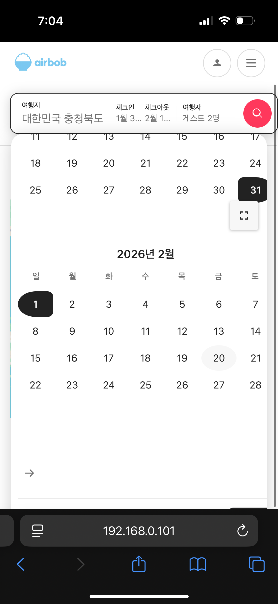

# tier 2

다음 달로 넘어가는 버튼이 아래에 있는데, 이거를 이전 달로 가는 버튼과 같은 행에 위치시켜주고 그 쪽 패딩은 없애줘. 그리고 닫기 버튼이 잘 안보이는데 닫기 버튼쪽은 고정시켜주고, 달력부분만 스크롤 되도록 해줘.

숙소 상세에서 숙소 이미지가 

- 데스크톱
    - 여기서는 다른 영역과 다르게 왼쪽은 괜찮은데 오른쪽에 패딩이 너무 많아. 이거 적절하게 바꿔봐.

- 모바일/태블릿
    - 여기서는 대표 사진만 보이고 있어서 오른쪽 하단에 번호를 붙이고 슬라이드로 넘겨서 볼 수 있게 해봐.
    - 예) 아래 사진
    
    
    
- 현재 상태(누르면 전체사진 볼 수는 있긴함 → 이것을 슬라이드 형식으로 변경 필요)
    
    