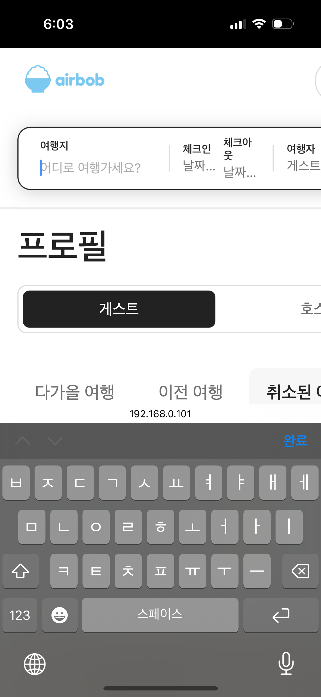

# tier 2

## **1. 공통 – 검색바 + 달력 + Google Place 겹침**

- 페이지: 공통 헤더 검색바
- 재현:
    1. 체크인/체크아웃 인풋 클릭 → 달력 열림
    2. 그대로 “여행지” 인풋 클릭 → place dropdown이 열리지만, 달력 위에 가려져 안 보임
- 기대 동작:
    - 여행지 인풋 포커스 시 **달력은 자동 닫힌다**
- 타입/우선순위: [P1][BUG][레이어링(z-index)]

## 2. 모바일

### 2.1 헤더 검색바가 아예 사라짐(아이폰 14 Pro)

- 페이지: 모든 페이지의 공통 헤더
- 재현: iPhone 14 Pro Safari/Chrome, 폭 390px 기준
- 현상:
    - 데스크톱/태블릿에는 있는 검색바가 모바일 헤더에서는 완전히 사라짐.
- 기대:
    - 모바일에서도 최소한 “검색으로 진입할 수 있는 버튼/축약형 검색바”는 항상 보여야 함.
- 타입/우선순위: [P0][BUG][RESPONSIVE] 모바일 헤더에서 검색 진입 불가

### 2.2 프로필 - 호스트/게스트 모드 탭 + 타이틀 겹침

- 페이지: /profile (host/guest mode)
- 재현: 모바일/태블릿 공통
- 현상:
    - “예약 관리”, “숙소 관리” 타이틀이 처음엔 탭과 적당한 간격인데,
    - 카드가 렌더링되면 위쪽으로 밀려 올라가 탭과 시각적으로 겹쳐 보인다.
- 원인 추정:
    - 타이틀 컨테이너에 margin-top / padding-top 값이 카드 존재 여부에 따라 달라짐.
    - 또는 상단 컨테이너 높이가 auto라, 리스트가 생기면서 타이틀이 딸려 움직임.
- 기대 동작:
    - 카드가 하나 이상 렌더링되더라도 탭 영역과 타이틀 사이 수직 간격은 항상 일정하게 유지되어야 함.
- 타입: [P1][BUG][LAYOUT] 리스트 렌더링 시 프로필 타이틀이 탭과 겹쳐 보이는 문제

### 2.3 숙소 등록 폼 1/2/3단계 - 모바일에서 너비 넘침

- 페이지: /accommodations/new step 1 / step 2(사진 업로드 전) / step 3
- 재현: iPhone 14 Pro Safari
- 현상:
    - 텍스트필드/드롭다운/버튼이 viewport보다 약간 넓게 렌더링되어,
    실제 가로 스크롤바 UI는 보이지 않지만 화면을 좌우로 드래그하면 컨텐츠가
    조금씩 움직일 정도로 폭이 넘친다.
- 기대:
    - 모바일에서는 폼 컨테이너 width = 100%, 내부 요소는 width: 100% - padding 구조.
- 타입: [P1][BUG][RESPONSIVE] 숙소 등록 step1/3 폼 요소가 모바일 폭을 넘김

### 2.4 숙소 사진 등록(업로드 시) - 스크롤할수록 사진이 점점 확대

- 페이지: /accommodations/new step 2 (사진 등록)
- 재현: iPhone 14 Pro Safari, 스크롤 위아래 반복
- 현상:
    - 첫 진입 시 썸네일들은 정상 크기.
    - 아래로 스크롤 → 다시 위로 스크롤 시, 아래에 있던 썸네일들이 점점 확대되어 viewport를 채움.
- 기대:
    - 스크롤 전후에도 이미지 크기와 비율은 항상 동일하게 유지되어야 하며, 확대/왜곡이 발생하지 않아야 한다.
- 타입: [P1][BUG][Safari 렌더링] 스크롤 시 썸네일 이미지 확대/왜곡
- 사진순으로 아래 스크롤한 것. 위 스크롤한다고 되돌아오진 않음

